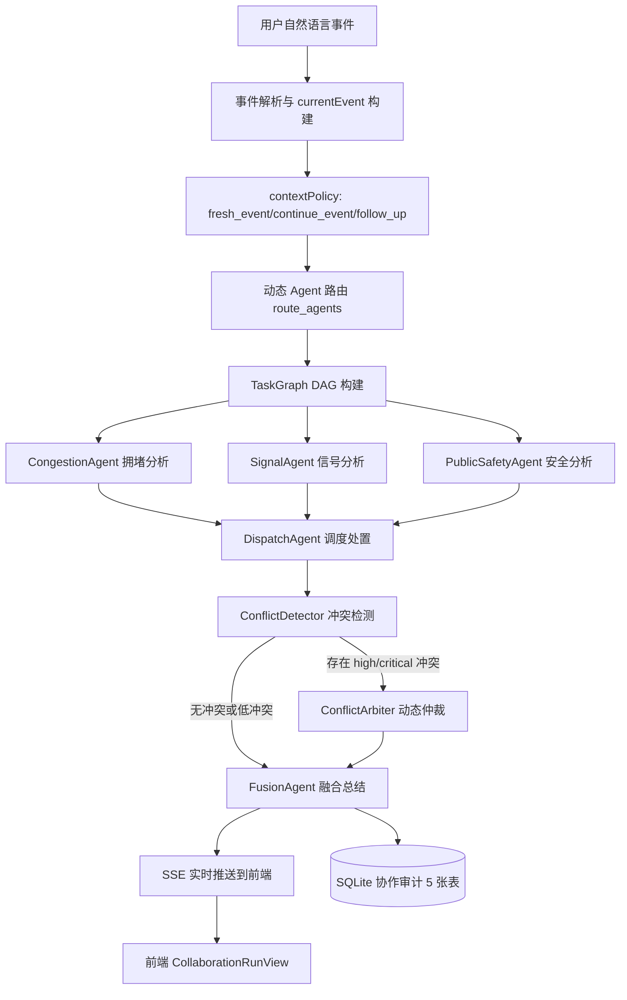
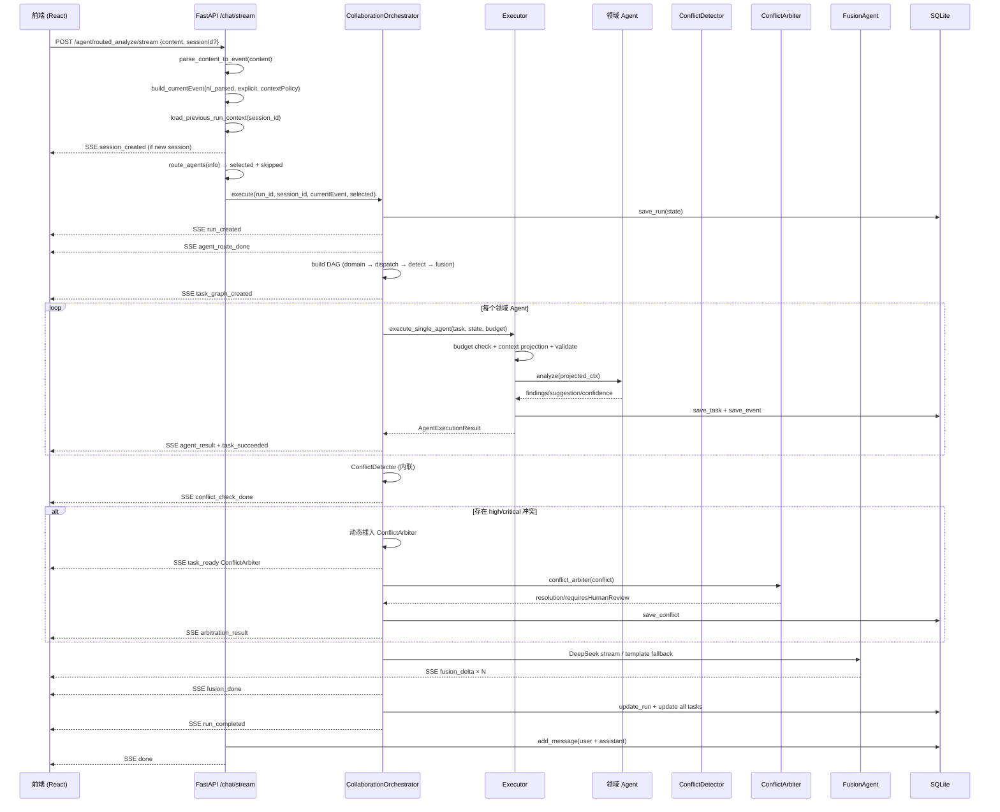

# TrafficMind Agent

**面向智慧交通的事件研判与协同处置 Agent 工作台**

TrafficMind Agent 是一个智能交通事件分析系统，支持从事件研判、知识库问答、相似案例检索、日报周报生成到多 Agent 协同编排的全链路智慧交通工作台。后端基于 **FastAPI**，前端使用 **React + TypeScript**，集成 **DeepSeek LLM**、**Chroma 向量检索（RAG）**、**SSE 真流式**、**多 Agent DAG 编排**和 **SQLite 持久化**。LLM 不可用时具备完整的可控降级能力。

**Phase 10 Memory V2** 将多轮交通研判转化为**可追踪、可纠正、可过期、按事件线程隔离并可按 Agent 最小权限注入**的结构化 Session Memory，包含 Event Thread 隔离、确定性意图分类、可解释过滤排序、用户纠正 Supersede 链、Proposal 确认绑定、Memory Trace 完整追踪和前端可观测面板。

> **一句话简历版**：独立设计并实现 TrafficMind Agent — 基于 FastAPI + LangGraph + React 的智慧交通多 Agent 协同研判系统，支持自然语言事件解析、动态 Agent 路由、DAG 任务编排、冲突检测仲裁、SSE 流式推送和历史会话完整恢复。

---

## 当前功能总览

### Phase 1：交通事件分析 MVP
- POST `/analyze_event` — 8 种交通事件类型的全链路分析（解析→评分→规则→建议→话术→报告→存储→通知）
- 确定性风险评分引擎（基础分 + 9 项加权规则，上限 100 分）
- 本地 Markdown 规则库，无需外部数据库
- React 深色大屏 Dashboard（统计卡片、图表、事件列表）

### Phase 2：相似案例、日报周报、未闭环提醒、高风险路口
- 历史相似案例检索（9 维规则相似度，预留向量扩展接口）
- 7 段式交通事件日报/周报生成
- 未闭环事件自动提醒（含提醒原因和处置建议）
- 高风险路口 TopN 统计（含管理建议）

### Phase 3：RAG 向量检索、混合检索、多 Agent 分析
- Chroma 向量数据库集成，DeepSeek Embedding
- 语义级相似案例检索 + 关键词混合检索
- 检索增强生成（RAG）：历史案例上下文注入 LLM prompt
- 多 Agent 分析框架（CongestionAgent / AccidentAgent / SignalAgent / DispatchAgent）

### Phase 4：受控 ReAct、动态路由、冲突检测、链式协同
- ReAct 诊断 Agent（只读工具白名单，thought/action/observation 链路）
- 动态 Agent 路由：根据事件类型、风险等级、天气/路段特征选择 Agent
- Agent 建议冲突检测与融合
- 事件驱动链式协同（规则触发式链式调用）

### Phase 5：AI 对话式工作台
- 浅色主题现代 AI 工作台（品牌色 #0F766E）
- 左侧 Sidebar + 8 个导航视图 + 动态最近分析
- ChatWorkspace 对话消息流 + 前端伪流式回答
- 12 个场景卡片入口 + 5 种分析模式

### Phase 6：会话持久化、可信 RAG、上下文管理
- SQLite 4 张表：chat_sessions / chat_messages / chat_memory_summaries / rag_evidence_logs
- 5 个 Chat REST API
- 召回→重排→阈值过滤→证据打包→grounded answer
- 4 级置信度（none/low/medium/high），证据不足时主动拒答（abstain）

### Phase 7：产品工作台、LLM 环境加载、标题与模式隔离
- `/api/llm_env` 环境信息接口
- 自动标题生成（8-15 字中文，首轮锁定）
- mode 标签（诊断/知识库/研判/相似/报告/协同）
- 入口统一、模式隔离

### Phase 8：真实 SSE 流式、统一会话历史
- `POST /chat/stream` — 通用对话 SSE 流式（支持 6 种 mode）
- `POST /agent/routed_analyze/stream` — 协同分析 SSE 流式
- DeepSeek `stream=true` 真流式 delta 转发
- 所有工作区统一写入 chat_sessions/chat_messages

### Phase 9：生产式多 Agent 协同编排与审计（当前阶段）
- **Agent Role Registry**：7 个注册 Agent，声明能力边界、输入输出约束、依赖关系
- **结构化 Agent 消息协议**：14 种标准消息类型，Pydantic 模型校验，全局唯一 ID
- **Shared Run State**：11 状态运行状态机，合法转换校验，可中断/可恢复
- **Context Projection**：每个 Agent 只接收角色允许的字段子集（最小权限原则）
- **Event Bus**：内存事件总线（message_id 幂等去重），预留 Redis Streams 扩展
- **TaskGraph DAG**：5 层拓扑排序执行，DFS 循环检测，支持动态插入中间节点
- **Orchestrator**：编排器负责创建 state、构建 DAG、循环执行、持久化和 SSE 推送
- **Executor**：预算检查→上下文裁剪→字段校验→执行→重试（区分可重试/不可重试错误）
- **执行预算**：maxAgents/maxAgentCalls/maxRetries/maxTotalSeconds 硬限制
- **超时与重试**：asyncio.wait_for 超时保护，可重试/不可重试错误分类
- **动态 Agent 路由**：根据事件类型、风险等级、环境特征选择参与研判的 Agent
- **ConflictDetector**：关键词匹配检测 4 类冲突（strategy/priority/resource/safety）
- **ConflictArbiter**：规则引擎仲裁，high/critical 冲突标记 requiresHumanReview
- **FusionAgent**：DeepSeek 流式融合 / 模板降级，仲裁结果注入 prompt
- **SSE 实时推送**：20+ 种事件类型（session_created → run_completed → done）
- **SQLite 协作审计**：5 张表（collaboration_runs/tasks/messages/conflicts/events）
- **多轮 Session 与 Run 关系**：一个 chat_session 包含多个 collaboration_run
- **历史 Run 完整恢复**：DAG/Agent/Conflict/Arbiter/Budget/Fusion 全部恢复
- **最近分析记录删除**：删除 Session 时级联清理全部协作数据

---

## Phase 9 核心能力详解

### Agent Role Registry

每个 Agent 在 [backend/agent/collaboration/roles.py](backend/agent/collaboration/roles.py) 中注册，声明：
- `allowed_input_fields`：允许接收的字段（上下文裁剪依据）
- `required_input_fields`：必需字段（缺字段提前失败）
- `max_calls` / `max_retries` / `timeout_seconds`：执行预算限制
- `dependencies`：依赖的其他 Agent 名称列表
- `forbidden_responsibilities`：明确禁止的职责边界

### 结构化 Agent 消息协议

基于 Pydantic `AgentMessage` 模型（[backend/agent/collaboration/protocol.py](backend/agent/collaboration/protocol.py)），14 种标准消息类型：
`task.assign | task.started | task.result | task.failed | tool.request | tool.result | conflict.detected | arbitration.request | arbitration.result | fusion.request | run.completed | run.failed | heartbeat`

每条消息包含 `message_id`（全局唯一）、`run_id`、`session_id`、`sender`、`receiver`、`priority`、`attempt`、`context_refs`、`evidence_refs` 等字段。

### Shared Run State

`CollaborationRunState` 管理单次运行的完整状态（[backend/agent/collaboration/state.py](backend/agent/collaboration/state.py)），包含 11 种状态：
`created → routing → running → arbitrating → fusing → completed`
支持 `partial_success`、`failed`、`requires_human_review`、`interrupted` 等终止状态。状态转换有合法校验。

### Context Projection

每个 Agent 只接收其角色允许的字段子集（[backend/agent/collaboration/context_projection.py](backend/agent/collaboration/context_projection.py)）。DispatchAgent 额外接收领域结果，ConflictArbiter 只接收冲突数据，FusionAgent 接收完成结果和仲裁结果。遵循最小权限原则。

### Event Bus

内存事件总线 `InMemoryEventBus`（[backend/agent/collaboration/event_bus.py](backend/agent/collaboration/event_bus.py)），支持 `publish(message)`（message_id 幂等去重）、`subscribe(message_type, handler)`、`get_history(run_id)`。设计为后续可替换为 Redis Streams / RabbitMQ。

### TaskGraph DAG

`CollaborationTaskGraph`（[backend/agent/collaboration/task_graph.py](backend/agent/collaboration/task_graph.py)）管理任务节点 `AgentTaskNode`，支持：
- 拓扑排序（DFS）
- 循环依赖检测（DFS + recursion stack）
- 动态节点插入（检测到 high/critical 冲突时插入 ConflictArbiter）
- 失败传播（blocked 状态级联）

### Orchestrator

`CollaborationOrchestrator`（[backend/agent/collaboration/orchestrator.py](backend/agent/collaboration/orchestrator.py)）负责：
1. 创建 `CollaborationRunState`
2. 构建初始 DAG（领域 Agent → DispatchAgent → ConflictDetector → FusionAgent）
3. 循环执行：`get_ready_tasks()` → execute
4. 领域 Agent 通过 `execute_single_agent()` 调用
5. 系统 Agent（ConflictDetector / ConflictArbiter / FusionAgent）内联执行
6. ConflictDetector 后条件插入 ConflictArbiter（仅当 high/critical 冲突）
7. 完成 → 持久化 → SSE 事件

### Executor

`execute_single_agent()`（[backend/agent/collaboration/executor.py](backend/agent/collaboration/executor.py)）执行流程：
1. 预算检查 → 记录调用
2. 上下文裁剪 (`project_context_for_agent`)
3. 必填字段校验 (`validate_required_fields`)
4. 调用 Agent 函数 → 包装为 `AgentResult` Pydantic 模型
5. 发布 `task.result` 到 EventBus
6. 失败时：区分可重试（timeout/临时错误）和不可重试（ValidationError/缺字段）

### 执行预算

`ExecutionBudget`（[backend/agent/collaboration/budget.py](backend/agent/collaboration/budget.py)）默认值：
- `max_agents`: 4（实际传入值）/ 6（类默认值）
- `max_agent_calls`: 2（每个 Agent 调用上限）
- `max_retries`: 1-2（最大重试数）
- `max_total_seconds`: 90-120（总超时）
- `max_total_tasks`: 12

### 冲突检测与仲裁

**ConflictDetector**（[backend/agent/collaboration/orchestrator.py](backend/agent/collaboration/orchestrator.py) `_detect_simple_conflicts`）检测 4 类冲突：

| 类型 | 严重性 | 条件 |
|------|--------|------|
| `strategy_conflict` | high | Signal（信号/配时）vs Safety（学校/行人） |
| `priority_conflict` | high | 通行效率优先级 vs 学生过街安全优先级 |
| `resource_conflict` | high | 同一信号周期内机动车绿灯 vs 行人过街相位 |
| `safety_conflict` | medium | 分流/放行方案可能增加行人安全风险 |

**ConflictArbiter**（[backend/agent/collaboration/agents.py](backend/agent/collaboration/agents.py) `conflict_arbiter`）：
- severity=low/medium → 自动解决（`resolved=True`）
- severity=high → `requiresHumanReview=True`，`resolved=False`
- 输出 `safetyFirstRule`、`resolution`、`limitations`

**FusionAgent**：DeepSeek 流式生成 / 模板降级，prompt 注入 Agent 结果和仲裁结果上下文。

**以"学校门口行人安全与机动车通行效率冲突"为例：**

SignalAgent 建议延长机动车绿灯提高通行效率，PublicSafetyAgent 强调保障学生过街相位。ConflictDetector 识别出同一信号周期的资源冲突（severity=high），ConflictArbiter 采用安全优先原则（"学生生命安全绝对优先"），标记 `requiresHumanReview=true`，FusionAgent 输出融合方案。

> **注意**：系统不自动控制真实交通信号灯，所有建议仅供人工参考。

### SSE 实时推送

20+ 种事件类型（详见 [SSE 事件协议](#sse-事件协议) 章节），覆盖从会话创建到运行完成的完整生命周期。

### SQLite 协作审计

5 张表（[backend/agent/collaboration/db_repository.py](backend/agent/collaboration/db_repository.py)）：
`collaboration_runs` / `collaboration_tasks` / `collaboration_messages` / `collaboration_conflicts` / `collaboration_events`

删除 Session 时级联清理全部协作数据。

### 多轮 Session 与 Run 关系

```
一个 chat_session
  ├── 第1个 collaboration_run（第1轮协同研判）
  ├── 第2个 collaboration_run（第2轮协同研判）
  └── 第N个 collaboration_run（第N轮协同研判）
```

- Session 代表一条"最近分析记录"
- Run 代表一次独立协同研判
- 同一个 Session 允许多轮提问
- Sidebar 只显示一条 Session
- 页面按创建时间显示第1轮、第2轮……
- 默认选中最新一轮
- 切换历史会话后按 Run 详情重新水合

---

## Agent 角色说明

| Agent | 主要职责 | 输入 | 输出 | 典型触发场景 | 类型 |
|-------|---------|------|------|-------------|------|
| **CongestionAgent** | 拥堵分析（avgSpeed/queueLength/拥堵扩散） | 道路名、平均速度、排队长度、天气、时间段 | 拥堵 findings、urgency、suggestion | 拥堵/缓行/排队事件 | 领域 Agent |
| **SignalAgent** | 信号控制分析（绿信比/周期/协调） | 道路名、速度、排队、信号状态、相位 | 信号优化 findings、suggestion | 信号灯异常/拥堵信号优化 | 领域 Agent |
| **PublicSafetyAgent** | 公共安全分析（学校/医院/行人/事故） | 道路名、学校/医院标记、行人风险 | 安全 findings、urgency | 学校/医院周边事件 | 领域 Agent |
| **DispatchAgent** | 调度处置（读取领域结果，生成调度方案） | 领域 Agent 结果、道路信息 | 调度 action、负责单位 | 所有协同分析的处置阶段 | 领域 Agent |
| **ConflictDetector** | 冲突检测（比较 Agent proposals） | task_results（所有 Agent 结果） | 冲突列表（conflicts） | 多 Agent 结果可能矛盾时 | 系统 Agent |
| **ConflictArbiter** | 冲突仲裁（规则引擎） | 冲突数据（conflicts） | 仲裁结果（resolution/requiresHumanReview） | 检测到 high/critical 冲突时动态插入 | 系统 Agent |
| **FusionAgent** | 融合总结（只融合已确认结果） | Agent 结果 + 仲裁结果 | 融合决策 / SSE 流式文本 | 所有协同分析的最终阶段 | 系统 Agent |

---

## 协同执行架构



---

## 一次协同运行的执行流程



---

## Session、Run 与 Memory 设计

### 数据模型

```
一个 chat_session（Sidebar 中的一条"最近分析"）
  ├── 第 1 个 collaboration_run（第 1 轮协同研判）
  ├── 第 2 个 collaboration_run（第 2 轮协同研判）
  └── 第 N 个 collaboration_run（第 N 轮协同研判）
```

### 关键设计原则

- **Session 代表一条最近分析记录**，Sidebar 只显示一条 Session
- **Run 代表一次独立协同研判**，每次 POST 请求创建一个新的 Run
- **同一个 Session 允许多轮提问**，每轮创建一个新 Run
- **页面按创建时间显示第 1 轮、第 2 轮……**，通过 `ORDER BY started_at ASC` 排序
- **默认选中最新一轮**，用户可切换轮次
- **切换历史会话后按 Run 详情重新水合**

### currentEvent 隔离

`currentEvent` 严格只包含当前消息提供或解析出的字段，**永不合并上一轮数据**。

```python
currentEvent = build_current_event(nl_parsed, explicit, context_policy)  # 仅当前消息
previousRunContext = load_previous_run_context(session_id)                # 独立加载
```

**禁止**：`currentEvent = {**previousEvent, **parsedCurrentMessage}`（这是 Phase 9 修复的核心 bug 之一）

### previousRunContext

独立存储的上一次运行上下文，仅包含摘要和稳定字段：

```json
{
  "runId": "run_1710000000",
  "summary": "上一轮为人民路主干道拥堵研判",
  "status": "completed",
  "event": {
    "avgSpeed": 8.0, "queueLength": 400,
    "roadName": "人民路", "eventTypeCn": "拥堵",
    "nearbySchool": true, "nearbyHospital": false, "isMainRoad": true
  },
  "updatedAt": "2026-07-24T10:00:00"
}
```

### contextPolicy

| 策略 | 动态字段（avgSpeed/queueLength/duration） | 稳定字段（roadName/school/hospital...） | 触发条件 |
|------|----------|----------|----------|
| `fresh_event` | 仅当前 NL 解析 | 仅当前 NL 解析 | 默认 / 重新描述事件 |
| `continue_event` | None（除非明确引用） | 可继承上一轮 | "继续"/"上述" 且无新数字 |
| `follow_up` | 仅当前 NL 解析 | 仅当前 NL 解析 | 普通追问 |

### fieldSources

每个字段追踪来源：`current_message` / `missing` / `explicit_value` / `explicit_previous_reference`。

**关键规则**：动态字段如 `avgSpeed`、`queueLength`、`duration` 不得静默继承上一轮的值，必须来自当前消息。防止跨轮数据污染。

---

## 历史水合机制

### 恢复链路

```
点击 Sidebar session（mode=collaboration）
  → setView("multi")
  → GET /chat/sessions/{sessionId}
  → GET /collaboration/sessions/{sessionId}/runs
  → 默认选中最新 runId
  → GET /collaboration/runs/{runId}
  → deserializeRunDetail → 渲染 CollaborationRunView
```

### deserializeRunDetail 恢复内容

`deserializeRunDetail`（[frontend/src/App.tsx](frontend/src/App.tsx)）恢复：

1. **Run 元信息**：runId, traceId, sessionId, status, executionEngine
2. **DAG 任务**：tasks（taskId, agentName, status, dependsOn, attempt...）
3. **Agent 结果**：agentResults（findings, confidence, suggestion, urgency...）
4. **冲突记录**：conflicts（type, severity, participants, proposals, resolution...）
5. **仲裁结果**：arbitrationResults（resolved, requiresHumanReview, safetyFirstRule...）
6. **预算消耗**：budgetUsage
7. **最终融合决策**：finalDecision（fusionSummary, actionPlan, arbitration...）
8. **上下文策略**：contextPolicy, fieldSources, previousRunContext

历史 Run 详情页面不再只显示简短 `chat_messages` 摘要，而是完整恢复 DAG、Agent 卡片、冲突面板、仲裁结果、预算和融合决策。

### RunSummary 不覆盖 RunDetail

列表接口 `GET /collaboration/sessions/{session_id}/runs` 返回摘要（仅 status/时间），不包含 tasks/agentResults/conflicts。详细数据通过独立 `GET /collaboration/runs/{run_id}` 获取。

---

## 冲突检测与仲裁

### 冲突类型

| 类型 | 严重性 | 检测条件 |
|------|--------|----------|
| `strategy_conflict` | high | SignalAgent（信号/配时/绿/周期）vs PublicSafetyAgent（学校/医院/行人/过街/安全） |
| `priority_conflict` | high | 通行效率优先级 vs 学生过街安全优先级 |
| `resource_conflict` | high | 同一信号周期内机动车绿灯时间 vs 行人过街相位争抢 |
| `safety_conflict` | medium | CongestionAgent（分流/放行）可能增加行人安全风险 |

### 示例：学校门口行人安全 vs 机动车通行效率

SignalAgent 建议延长机动车绿灯、优化通行效率；PublicSafetyAgent 建议保障行人过街相位。

ConflictDetector 识别出 `strategy_conflict`、`priority_conflict`、`resource_conflict`（severity 均为 high）— 同一信号周期资源冲突。

ConflictArbiter 采用安全优先规则：
```json
{
  "event": "arbitration_result",
  "data": {
    "conflictId": "arb_0",
    "requiresHumanReview": true,
    "safetyFirstRule": "在学生过街安全与机动车通行效率冲突时，学生生命安全绝对优先。",
    "resolution": "高风险冲突需要人工研判",
    "limitations": [
      "信号配时精确值需现场勘查确认",
      "学生过街流量需学校提供统计数据"
    ]
  }
}
```

FusionAgent 输出最终融合方案，`requiresHumanReview=true` 标记人工复核。

> **注意**：系统不自动控制真实交通信号灯。

---

## 执行预算和可靠性

### 默认值

| 参数 | 默认值 | 说明 |
|------|--------|------|
| `max_agents` | 4 | 最大领域 Agent 数量 |
| `max_agent_calls` | 2 | 每个 Agent 调用上限 |
| `max_retries` | 1 | 最大重试数 |
| `max_total_seconds` | 90 | 总超时时间（秒） |
| `max_total_tasks` | 12 | 最大任务总数 |

### 状态机

11 种状态：
- **运行中**：`created → routing → running → arbitrating → fusing`
- **成功终止**：`completed`
- **降级终止**：`partial_success`（部分 Agent 失败）、`requires_human_review`
- **失败终止**：`failed`
- **中断**：`interrupted`

### 降级策略

- 超时 → 该 Task 标记 failed，不影响其他 Agent
- 部分失败 → 状态切换为 `partial_success`，FusionAgent 消费已完成的结果
- FusionAgent 失败 → 模板降级 `_build_fusion(state)`
- LLM 不可用 → `template_fallback` 模式（已有 template 正常输出）
- 不可重试错误（ValidationError/缺少字段/未注册）→ 直接失败，不重试

---

## SSE 事件协议

### 关键事件

| 事件 | 有无 runId | 说明 |
|------|-----------|------|
| `session_created` | 无 | 新会话创建（仅 sessionId） |
| `event_parse_done` | 有 | 自然语言解析完成 |
| `run_created` | 有 | 运行实例创建（含 sessionId/contextPolicy/fieldSources/previousRunContext） |
| `agent_route_done` | 有 | Agent 路由完成（selectedAgents + routingReasons） |
| `task_graph_created` | 有 | DAG 任务图创建（所有 tasks） |
| `task_ready` | 有 | 任务就绪等待执行 |
| `task_started` | 有 | 任务开始执行 |
| `budget_updated` | 有 | 预算消耗更新 |
| `agent_result` | 有 | Agent 分析结果（findings/suggestion/confidence/executionMode） |
| `task_succeeded` | 有 | 任务成功完成 |
| `task_failed` | 有 | 任务失败（含错误信息） |
| `conflict_check_done` | 有 | 冲突检测完成（conflicts + conflictCount） |
| `arbitration_result` | 有 | 仲裁结果（requiresHumanReview/safetyFirstRule/resolution） |
| `fusion_start` | 有 | 融合开始 |
| `fusion_delta` | 有 | 融合文本增量（SSE 逐块推送） |
| `fusion_done` | 有 | 融合完成（fusionSummary + generationMode） |
| `run_completed` | 有 | 运行完成 |
| `run_partial_success` | 有 | 部分成功 |
| `run_failed` | 有 | 运行失败 |
| `done` | 有 | 流结束（sessionId/title） |

### 前端处理

前端通过 `fetch` + `ReadableStream` + `TextDecoder` 解析 SSE 事件流。使用 `useRef` 管理 `sessionIdRef` 防止闭包过期问题。SSE 失败时展示错误信息，连接中断时显示连接状态。

---

## 数据库模型

### 表结构

| 表名 | 职责 | 主要关联键 |
|------|------|-----------|
| `chat_sessions` | 会话元信息（id, title, mode, summary, created_at） | PK: id |
| `chat_messages` | 聊天消息（user/assistant, content, mode, result_summary） | FK: session_id → chat_sessions.id |
| `chat_memory_summaries` | 会话长期摘要（summary, key_topics, unresolved_questions） | FK: session_id → chat_sessions.id |
| `rag_evidence_logs` | RAG 证据日志（query, evidence, score, doc_type, accepted） | FK: session_id → chat_sessions.id |
| `collaboration_runs` | 协作运行元信息（status, normalized_event, selected_agents, budget_usage, final_decision, previous_run_context） | PK: run_id; FK: session_id |
| `collaboration_tasks` | DAG 任务（task_id, agent_name, status, depends_on, input_snapshot, output_snapshot） | PK: (run_id, task_id) |
| `collaboration_messages` | Agent 通信消息审计（sender, receiver, message_type, payload） | PK: message_id; indexed by run_id |
| `collaboration_conflicts` | 冲突记录（type, severity, participants, proposals, resolution） | PK: (run_id, conflict_id) |
| `collaboration_events` | 运行时事件（event_type, payload, sequence_number） | PK: (run_id, event_id) |

### 关系示意

```
chat_sessions
  ├── chat_messages（会话消息）
  ├── chat_memory_summaries（长期摘要）
  ├── rag_evidence_logs（RAG 证据）
  └── collaboration_runs（协作运行）
        ├── collaboration_tasks（DAG 任务）
        ├── collaboration_messages（Agent 通信）
        ├── collaboration_conflicts（冲突记录）
        └── collaboration_events（运行时事件）
```

### 级联删除

删除 Session 时（[backend/chat/chat_db.py](backend/chat/chat_db.py) `delete_session`）：
1. 级联删除所有 `collaboration_tasks`
2. 级联删除所有 `collaboration_messages`
3. 级联删除所有 `collaboration_conflicts`
4. 级联删除所有 `collaboration_events`
5. 级联删除所有 `collaboration_runs`
6. 级联删除 `chat_messages`、`chat_memory_summaries`、`rag_evidence_logs`
7. 最后删除 `chat_sessions`

---

## API 说明

### Chat 接口

| 方法 | 路径 | 用途 | 关键输入 | 关键输出 |
|------|------|------|---------|---------|
| POST | `/chat/stream` | SSE 流式对话（6 种 mode） | content, mode, sessionId?, agents?, evidence?, contextPolicy? | SSE 事件流 |
| GET | `/chat/sessions` | 会话列表（按最后消息时间降序） | — | sessions[] |
| GET | `/chat/sessions/{id}` | 会话详情 + 消息列表 | — | session + messages[] |
| PATCH | `/chat/sessions/{id}/title` | 修改会话标题 | title | session |
| DELETE | `/chat/sessions/{id}` | 删除会话及全部关联数据 | — | success |

### Collaboration 接口

| 方法 | 路径 | 用途 | 关键输入 | 关键输出 |
|------|------|------|---------|---------|
| POST | `/agent/routed_analyze/stream` | 多 Agent 协同分析 SSE 流式 | content, eventType?, roadName?, contextPolicy?, sessionId? | SSE 事件流（20+ 种事件） |
| GET | `/collaboration/sessions/{session_id}/runs` | 查询会话的 Run 列表 | — | runs[]（按 started_at ASC） |
| GET | `/collaboration/runs/{run_id}` | 查询 Run 完整审计记录 | — | run + tasks + messages + conflicts + events |

### 第一阶段（6 个）

| 方法 | 路径 | 说明 |
|------|------|------|
| POST | `/analyze_event` | 分析交通事件，返回完整研判结果 |
| GET | `/history?limit=50` | 查询历史记录 |
| GET | `/event/{event_id}` | 查询单条事件详情 |
| POST | `/event/{event_id}/status` | 更新事件状态（6 种流转） |
| GET | `/health` | 健康检查（含 Phase 9 orchestrator/vector 状态） |
| GET | `/stats` | 仪表盘聚合统计 |

### 第二阶段（5 个）

| 方法 | 路径 | 说明 |
|------|------|------|
| GET | `/similar_cases/{event_id}` | 历史相似案例检索（规则相似度） |
| GET | `/reports/daily` | 交通事件日报 |
| GET | `/reports/weekly` | 交通事件周报 |
| GET | `/alerts/unclosed` | 未闭环事件提醒 |
| GET | `/stats/high_risk_roads` | 高风险路口 TopN 统计 |

### 第三/四阶段新增（2 个）

| 方法 | 路径 | 说明 |
|------|------|------|
| POST | `/agent/react_diagnose` | 受控 ReAct 诊断 |
| POST | `/agent/routed_analyze` | 动态路由协同研判（REST 版） |

---

## Phase 9 关键 Bug 修复

| # | 现象 | 根因 | 修复 |
|---|------|------|------|
| 1 | `session_created` 事件被吞掉 | `session_created` 没有 `runId` 字段，但 SSE 事件处理器中有 `if (!event.runId) return` 的提前 return guard | 将 `session_created` 的处理逻辑放在 `runId` guard 之前，`session_created` 不依赖 `runId` |
| 2 | 新对话后仍复用旧 sessionId | `sessionIdRef` 是 `useRef`，但切换 session 时 `activeSessionId` 为 null，`useEffect` 同步逻辑未正确清空 ref | 显式在 `handleNewConversation` / `handleScenario` 中设置 `sessionIdRef.current = null` |
| 3 | SSE 流中 JSON.stringify 遗漏 sessionId | `session_created` 事件的 `sessionId` 为 `undefined` 时，`JSON.stringify` 会直接省略该 key | 确保后端始终正确传递 `sessionId`，前端在 `session_created` 处理中校验 `event.sessionId` |
| 4 | 同一页面多轮却创建多个 Session | 前端在每轮请求时不传 `sessionId`（因为 stale closure 读到的是 null） | 使用 `useRef` 管理 `sessionIdRef`，每次 `session_created` 和 `handleAnalyze` 都通过 ref 同步 |
| 5 | Run 历史接口 DESC → 历史页面轮次颠倒 | 列表 API `ORDER BY updated_at DESC` 导致最新 Run 排第一 | 改为 `ORDER BY started_at ASC, run_id ASC`，确保历史页面按时间先后展示 |
| 6 | `hydrateRun` 依赖预先存在的 `runsById` 条目 | 历史恢复时 `runsById` 为空，无法读取 `existing.contextPolicy` 等字段 | 从空也可以开始合并：`const existing = runsById[runId] || { runId }` |
| 7 | `currentEvent` 被硬编码或旧上下文污染 | `build_current_event` 中动态字段（avgSpeed/queueLength）可能静默继承上一轮值 | 严格分离 `currentEvent` 和 `previousRunContext`，动态字段默认 `None`（来源 `missing`） |
| 8 | ConflictPanel `agents`/`participants` 字段不一致导致渲染黑屏 | 后端 `_detect_simple_conflicts` 输出 `"agents"` 字段，但前端 ConflictPanel 消费 `"participants"` | 统一后端输出 `"agents"` 字段，保存到 DB 的 `participants` 列时从 `c.get("agents")` 读取 |
| 9 | Budget 面板显示 "3/0" | `ExecutionBudget.to_dict()` 缺少 `max` 字段，前端 `BudgetUsagePanel` 使用 `maxAgentCalls` 等字段时后端没传 | 在 `to_dict()` 中补充 `max_agent_calls` / `max_retries` / `max_total_seconds` / `max_total_tasks` |
| 10 | 当前会话删除后状态残留 | 删除 Session 后 `activeSessionId` 仍指向已删除的 ID，导致后续请求报 404 | `handleDeleteSession` 中清空 `sessionIdRef`、`activeSessionId`、`runsById`、`activeRunId`，并触发新会话流程 |

---

## 最近分析管理

支持以下会话管理功能：
- **历史会话列表**：按最后消息时间降序，显示 title + mode 标签
- **模式标识**：6 种 mode → 中文标签（协同/知识库/诊断/研判/相似/报告）
- **标题修改**：`PATCH /chat/sessions/{id}/title`（不改变排序位置）
- **会话删除**：`DELETE /chat/sessions/{id}`，级联清理全部关联数据
- **删除确认**：前端 Modal 确认弹窗
- **当前会话删除后的页面清理**：清空 `sessionIdRef`、`activeSessionId`、`runsById`、`activeRunId`
- **多轮 Run 恢复**：点击历史 Session → 加载所有 Run → 默认选中最新 Run → 完整水合

> **注意**：删除的是 Session 及全部关联数据（所有 Run、消息、冲突、事件），不是单个 Run。

---

## 技术栈

| 层级 | 技术 |
|------|------|
| Web 框架 | FastAPI + Uvicorn |
| 工作流引擎 | LangGraph 0.2.x |
| 多 Agent 协议 | Pydantic AgentMessage（14 种消息类型） |
| LLM（可选） | DeepSeek API（OpenAI-compatible，stream=true） |
| 向量检索 | Chroma + DeepSeek Embedding |
| 数据库 | SQLite（含自动兼容迁移 + WAL 模式） |
| 规则库 | 本地 Markdown |
| 前端 | React 18 + TypeScript + Ant Design 5 + ECharts 5 + Vite |
| 消息推送 | 企业微信 / 钉钉 Webhook + SMTP 邮件 |
| 测试 | pytest + FastAPI TestClient |

---

## 安装与启动

### 后端

```powershell
cd C:\Users\25442\trafficmind-agent
backend\.venv\Scripts\python.exe -m uvicorn backend.app:app --host 127.0.0.1 --port 8000
```

启动后访问：
- **Swagger API 文档**: http://127.0.0.1:8000/docs
- **健康检查**: http://127.0.0.1:8000/health

### 前端

```powershell
cd C:\Users\25442\trafficmind-agent\frontend
npm.cmd install
npm.cmd run dev
```

前端开发服务器：http://localhost:5173

### 环境变量配置

在 `backend/.env` 中配置（复制 `backend/.env.example`）：

```ini
DEEPSEEK_API_KEY=sk-xxx        # DeepSeek API Key（可选，不配则模板降级）
DEEPSEEK_BASE_URL=https://api.deepseek.com
DEEPSEEK_MODEL=deepseek-chat

# 消息推送（可选）
WECHAT_WEBHOOK_URL=https://qyapi.weixin.qq.com/cgi-bin/webhook/send?key=xxx
DINGTALK_WEBHOOK_URL=https://oapi.dingtalk.com/robot/send?access_token=xxx
SMTP_HOST=smtp.example.com
SMTP_PORT=465
SMTP_USER=alert@example.com
SMTP_PASSWORD=your_password
SMTP_TO=dispatch@example.com
HIGH_RISK_THRESHOLD=高风险
```

> **注意**：不要将真实 API Key 提交到仓库。

### 运行测试

```powershell
cd C:\Users\25442\trafficmind-agent
backend\.venv\Scripts\python.exe -m pytest backend\tests -q
```

---

## 测试与验收

### 自动化测试

- **pytest**：283 passed / 0 failed
- **TypeScript**：0 errors

### Phase 9 核心验收

| # | 验收项 | 状态 |
|---|--------|------|
| 1 | 同一 Session 连续多轮（每轮创建新 Run） | ✅ |
| 2 | 一个 Session 多个 Run，Sidebar 只显示一条 | ✅ |
| 3 | 轮次顺序稳定（按 started_at ASC） | ✅ |
| 4 | 历史完整水合（DAG/Agent/Conflict/Arbiter/Budget/Fusion） | ✅ |
| 5 | 冲突仲裁恢复（仲裁结果完整反序列化） | ✅ |
| 6 | Budget 恢复（max 字段完整） | ✅ |
| 7 | 会话删除（级联清理全部数据 + 前端状态复位） | ✅ |
| 8 | 刷新恢复（URL/state/sessionIdRef 保持一致） | ✅ |
| 9 | currentEvent 隔离（动态字段不静默继承） | ✅ |
| 10 | Context 策略（fresh_event/continue_event/follow_up） | ✅ |
| 11 | fieldSources 追踪（每个字段来源明确） | ✅ |
| 12 | Session 创建：session_created 无 runId 但正确处理 | ✅ |

### 手工验收场景

**普通拥堵**：
> "主干道平均车速8km/h，排队400米，请协同研判。"
→ DAG 4 层（CongestionAgent → DispatchAgent → ConflictDetector → FusionAgent），无仲裁。

**学校冲突**：
> "人民路小学门口早高峰严重拥堵，机动车需绿灯，学生需过街相位。"
→ DAG 5 层（含 ConflictArbiter），3 个仲裁结果，requiresHumanReview=true。

**多轮隔离**：
> 第 1 轮：avgSpeed=8 → 第 2 轮："学校门口拥堵" → 第 2 轮 avgSpeed=None（不继承）。

**历史恢复**：
> 刷新 → 点击历史 Session → 完整恢复 DAG/冲突/仲裁/融合。

---

## 项目边界与限制

- 当前是**本地单用户工作台**，非分布式系统
- SQLite 适合演示和轻量部署，高并发场景建议迁移 PostgreSQL
- **未接入真实信号机和交管派单系统**
- 部分 Agent 分析仍含规则模板（确定性为主、AI 增强为辅）
- 人工复核标记（`requiresHumanReview`）不等于真实审批流程
- **尚未完成生产级鉴权、RBAC 和多租户隔离**
- **尚未完成大规模并发压测**
- Memory 目前以 Session 内结构化上下文 + 上一轮 previousRunContext 为主
- EventBus 为内存实现，多进程部署需替换为 Redis Streams

---

## 后续规划

### 近期
- **Memory V2**：Session 长期摘要记忆，跨 Session 知识积累
- **Evaluation**：路由准确率、冲突检测召回率、RAG groundedness 评测集
- **Observability**：trace、延迟、失败率、Agent 调用统计

### 中期
- **Auth/RBAC**：多用户登录和数据隔离
- **并行 Agent 执行**：同层 Agent 使用 `asyncio.gather` 并行
- **LLM 辅助仲裁**：规则不足时调用 LLM 做深度分析

### 远期
- **Production**：PostgreSQL、Redis、Docker Compose、Nginx
- **Reliability**：取消/恢复/幂等/并发和压力测试
- **SUMO 仿真**：信号配时方案仿真验证
- **WebSocket 大屏推送**：实时指挥中心态势更新

---

## 消息推送配置

在 `.env` 中配置（可选，不影响核心功能）：

```ini
WECHAT_WEBHOOK_URL=https://qyapi.weixin.qq.com/cgi-bin/webhook/send?key=xxx
DINGTALK_WEBHOOK_URL=https://oapi.dingtalk.com/robot/send?access_token=xxx
SMTP_HOST=smtp.example.com
SMTP_PORT=465
SMTP_USER=alert@example.com
SMTP_PASSWORD=your_password
SMTP_TO=dispatch@example.com
HIGH_RISK_THRESHOLD=高风险
```

---

## 适合写进简历的项目描述

### 一句话版本

> 独立设计并实现 TrafficMind Agent — 基于 FastAPI + LangGraph + React 的智慧交通多 Agent 协同研判系统，支持自然语言事件解析、动态 Agent 路由、DAG 任务编排、冲突检测仲裁、SSE 流式推送和历史会话完整恢复，283 个测试用例全部通过。

### 要点版本（适合技能列表）

- 后端使用 **FastAPI + LangGraph** 构建多 Agent 协同编排引擎
- 设计 **Pydantic 标准 Agent 消息协议**（14 种消息类型）和 **11 状态运行状态机**
- 实现 **5 层 DAG 任务图**（拓扑排序 + 循环检测 + 动态节点插入 + 失败传播）
- 实现 **ConflictDetector + ConflictArbiter** 多 Agent 冲突检测与仲裁
- 集成 **Chroma 向量数据库 + DeepSeek Embedding** 实现 RAG 检索增强生成
- **SSE 真流式**（DeepSeek stream=true）全生命周期事件实时推送
- **SQLite 9 张表**持久化（chat + collaboration 完整审计）
- 前端使用 **React 18 + TypeScript + Ant Design 5 + ECharts 5 + Vite**
- **283 个 pytest 测试用例**全部通过，覆盖端到端功能验证

### STAR 版本（适合面试详细讲述）

**S (Situation)**：城市交通指挥中心面对多源交通事件，需要多个专业 Agent 协同分析（拥堵/信号/安全），但 Agent 之间缺乏标准通信协议、没有冲突仲裁机制、历史分析无法追溯和恢复。

**T (Task)**：设计并实现一套多 Agent 协同编排系统，支持 Agent 标准通信、DAG 任务编排、冲突检测仲裁、SSE 流式推送和历史运行完整恢复。

**A (Action)**：
- 基于 Pydantic 设计 14 种标准消息类型的 Agent 通信协议，所有消息唯一 ID 可审计
- 实现 7 个注册 Agent 的角色能力注册表（allowed_input_fields / dependencies / max_calls 等约束）
- 实现 5 层 DAG 任务图编排（拓扑排序 + DFS 循环检测 + 动态节点插入）
- 实现 Context Projection：每个 Agent 只接收角色允许的字段子集（最小权限原则）
- 实现 ConflictDetector（4 类冲突关键词检测）+ ConflictArbiter（规则引擎 + 安全优先）
- 实现 11 状态运行状态机，合法转换校验
- DeepSeek SSE 真流式融合（LLM 不可用时模板降级）
- SQLite 9 张表持久化（chat 4 + collaboration 5），删除 Session 时级联清理
- 实现多轮 Session/Run 关系模型（一 Session 多 Run，严格 currentEvent 隔离防跨轮数据污染）
- 修复 10 个关键工程 Bug（session_created runId guard、字段静默继承、历史颠倒等）
- 前端 React + TypeScript，useRef 管理 sessionIdRef 防闭包过期，deserializeRunDetail 完整历史水合

**R (Result)**：
- 283 个 pytest 测试用例全部通过，TypeScript 0 errors
- 支持同一 Session 多轮协同、完整历史恢复、会话删除级联清理
- 冲突仲裁场景（学校门口交通冲突）可正确检测 3 类 high 冲突并触发人工复核
- 零外部依赖可降级运行，不配任何 API Key 也能使用核心功能

---

## 面试讲解话术

### 项目介绍（30 秒版本）

> TrafficMind Agent 是一个智慧交通多 Agent 协同研判系统。用户用自然语言描述交通事件，系统自动解析、路由到合适的专业 Agent（拥堵/信号/安全），通过 DAG 编排执行，检测 Agent 建议冲突并仲裁，最终融合输出决策建议。后端用 FastAPI + Pydantic 协议 + SQLite 审计，前端是 React 浅色工作台。最大亮点是多 Agent 协同编排引擎——Agent 之间通过标准协议通信，有冲突检测和仲裁机制，每次运行完整可审计可恢复。

### 技术亮点（回答"你做了什么技术选型"）

> 我为 Agent 间通信设计了 Pydantic 标准协议而非随意 JSON——14 种消息类型有严格校验，每条消息全局唯一 ID，完整的审计追踪。DAG 编排没有用 Airflow 等重框架——自己实现轻量 TaskGraph，支持拓扑排序、循环检测和动态节点插入（检测到 high 冲突时动态插入仲裁层）。冲突仲裁采用规则引擎优先策略，规则不足时标记 requiresHumanReview，不盲目自动决策。前端用 useRef 而非 useState 管理 sessionId 防止闭包过期——这是实际踩过的坑。

### 难点攻克（回答"遇到什么困难"）

> 最大的难点是 currentEvent 隔离——前一个版本中动态字段（avgSpeed/queueLength）会从上一轮静默继承，导致多轮分析互相污染。我重构了 build_current_event 和整个数据流，严格分离 currentEvent 和 previousRunContext，每个字段追踪来源（fieldSources），动态字段默认 None（来源标记为 missing）。另一个难点是 session_created 事件没有 runId——前端早期代码有 `if (!event.runId) return` 的 guard，导致 session_created 被吞掉、Sidebar 不显示。修复方案是将 session_created 处理放在 runId guard 之前，因为它是唯一不依赖 runId 的事件。

### 扩展思考（回答"如果继续做你会加什么"）

> 一是 Memory V2：当前 Memory 以 Session 内上下文为主，后续可以加跨 Session 的长期摘要记忆。二是 Evaluation 体系：路由准确率、冲突检测召回率、RAG groundedness 评测集。三是生产化：PostgreSQL + Redis + Docker Compose + Nginx + JWT 鉴权。四是同层 Agent 并行执行——当前同层串行，用 asyncio.gather 可以显著提速。
