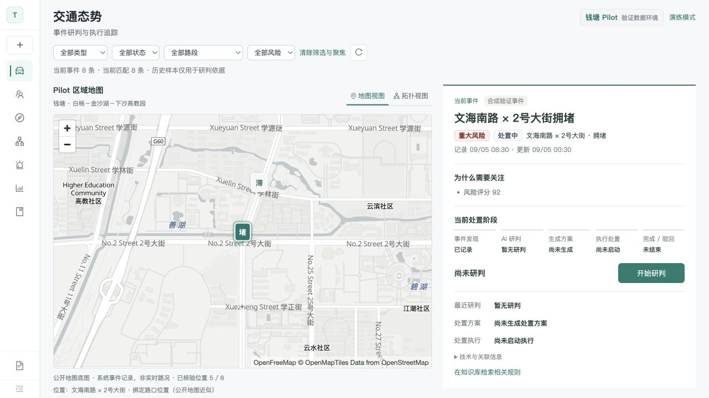
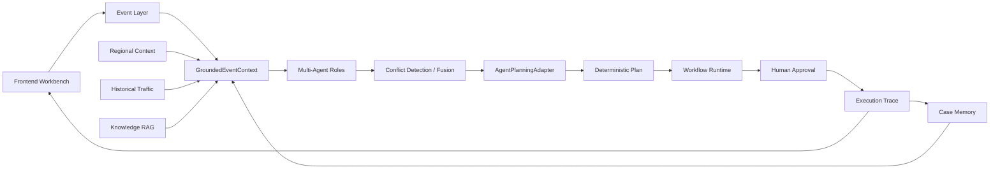
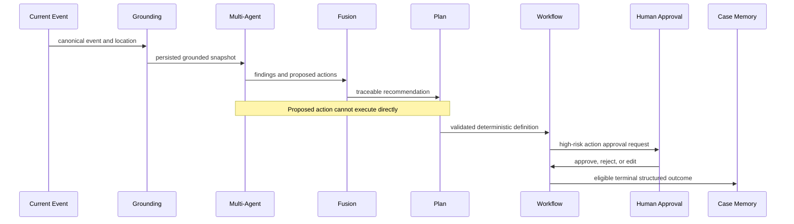
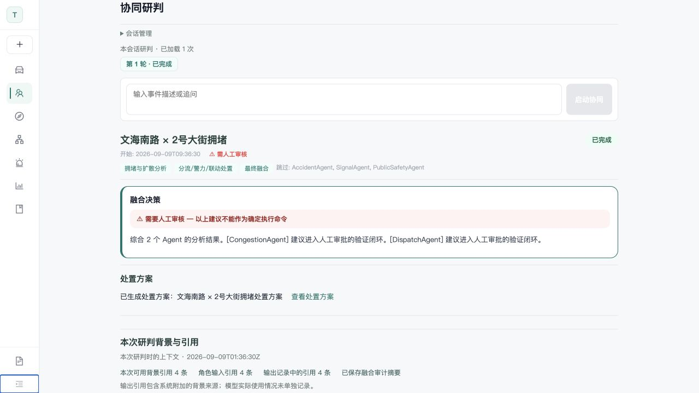

# TrafficMind

**面向城市交通事件的 Multi-Agent 研判与闭环执行系统。**

TrafficMind 将交通事件、区域道路上下文、历史事件、规则知识和系统闭环案例组织为可追溯的决策上下文，完成事件研判、处置方案生成、Workflow 执行、人工审批、执行追踪和 Case Memory 沉淀。系统不直接控制真实交通设施；模型或 Agent 提出的动作必须经过确定性校验和执行门控。

当前可运行的钱塘 Pilot 覆盖事故、拥堵、违停、行人风险、信号故障和车辆停驶六类验证事件。它使用真实公开地理与规则来源，但不是实时生产交通部署。



## 核心能力

### Multi-Agent 交通事件研判

系统按事件事实路由拥堵、事故、信号和公共安全等角色，由调度角色整合处置建议，并通过冲突检测、规则仲裁和 Fusion 形成可审计结果。共享上下文按角色投影，避免每个 Agent 获得无关字段。

### Grounded Decision Context

`GroundedEventContext` 将四类依据组合为一次不可变快照：canonical 区域绑定、严格早于当前事件的历史记录、满足区域与生效时间条件的知识证据，以及同区域、严格过去的 Case Memory。每条引用保留来源和追溯信息。

### 可控 Planning 与 Workflow

Agent 的 `proposed_actions` 先由 `AgentPlanningAdapter` 映射，再经过 Action Registry、参数约束和可执行能力检查，生成确定性 Plan 与 Workflow。未注册、仅仿真或不支持的动作会被拒绝，不能绕过执行边界。

### Case Memory 经验复用

只有到达 terminal 状态、具备 authority event record 与 canonical 区域绑定的合格 Workflow 才能生成 Case。Case 保存结构化事件、研判、方案、审批与执行结果，不把完整对话或原始 workflow state 当作经验。

## 系统架构



详细的组件边界、Agent 角色和持久化链路见[系统架构说明](docs/architecture.md)。

## Qiantang Pilot Demo

Pilot 范围为杭州市钱塘区白杨、金沙湖、下沙高教园片区。从仓库根目录启动：

```bash
./scripts/start-qiantang-demo.sh
```

启动完成后访问 <http://127.0.0.1:5174>。Demo 固定使用前端 `5174`、后端 `8011` 和独立 runtime stores；不会把默认 `backend/data/trafficmind.db` 隐式切换为 Pilot 数据。按 `Ctrl+C` 停止服务。

运行前需要：

- `backend/.venv/bin/python` 已安装依赖。
- `frontend/node_modules` 已安装依赖。
- `5174` 与 `8011` 端口可用。

完整启动行为、页面走查和故障说明见[钱塘 Pilot Demo 指南](docs/qiantang-pilot.md)。

## Agent 闭环



实际注册角色包括：`CongestionAgent`、`AccidentAgent`、`SignalAgent`、`PublicSafetyAgent`、`DispatchAgent`、`ConflictDetector`、`ConflictArbiter` 和 `FusionAgent`。系统执行的是结构化路由、检测、仲裁与融合，不宣称 Agent 之间存在开放式自动协商。



## Grounding 与 Case Memory

Grounding 的四块上下文分别承担不同职责：

| 上下文 | 作用 | 关键约束 |
|---|---|---|
| Regional | 规范化区域、道路、路口与附近 POI | 只采用 active/resolved canonical binding |
| History | 提供同区域历史事件统计和引用 | `createdAt` 严格早于当前事件 |
| Knowledge | 提供法规、标准和区域公开资料摘要 | 区域、事件类型和 effective time 必须满足条件 |
| Case Memory | 提供历史闭环中的结构化处置经验 | 同区域、严格过去、质量状态可用 |

Case 的追溯链为 `Case -> Workflow -> Plan -> Agent Run -> Event`。它保存 structured facts、审批记录和 terminal 状态，不保存完整 transcript、raw prompt 或完整 workflow state。当前后端支持按 Case 和 Event 查询；前端尚未提供完整的独立 Case 反向追溯浏览器。

## 安全执行机制

- LLM/Agent 只提出建议，不能直接执行工具动作。
- `AgentPlanningAdapter` 校验来源 event、session、run 和 persisted grounding。
- Action Registry 与参数 schema 对动作做 fail-closed 校验。
- Workflow Runtime 是执行状态与审计事实来源。
- 高风险动作通过 Human-in-the-loop Approval；系统不宣称全自动处置。
- 关系导航只使用 persisted IDs，不构造演示性的 1:1 绑定。


## 数据真实性说明

| 数据 | Reality | 可以支持的表述 |
|---|---|---|
| Regional geography | `real_public_verified` | 公开来源核验的有限 Pilot 道路、路口和 POI |
| Knowledge | `real_public_source_grounded` | 公开法规、标准和规划来源的项目摘要 |
| Public history | `real_public_reported_incident_history` | 公开报道或文书支持的事件级事实 |
| Synthetic history | `synthetic_validation` | 在真实地理上的覆盖与检索验证 |
| Current demo events | `synthetic_validation` | 钱塘 Pilot 当前事件链路验证 |
| Synthetic closure cases | `synthetic_event_system_closure` | 系统生成的合成事件闭环 |
| Public incident replay cases | `public_incident_replay_system_closure` | 公开事件事实上的系统回放闭环 |
| Agent provider in evaluation | `deterministic_validation` | 可重复的链路与追溯验证，不是在线 LLM benchmark |

因此，项目不能被描述为真实实时钱塘交通、生产事件流、交通部门历史处置方案、真实交通效果提升或线上 LLM 质量评测。完整来源、隐私和时间边界见[数据真实性与来源说明](docs/data-provenance.md)。

### 公开历史隐私

公开历史包只抽取交通事件级事实，不保存姓名、车牌、住址、保险、医疗和赔偿金额等个人信息，也不缓存或展示敏感原始裁判文书内容。

### 地图边界

前端使用 MapLibre GL JS，默认加载 OpenFreeMap Positron，并保留 OpenStreetMap attribution。公开地图只用于可视化，不是 location identity 的 authority，也没有 production SLA。事件位置仍由 canonical regional binding 决定；没有可靠坐标时不生成假 Marker。

## 技术栈

| 层级 | 实际技术 |
|---|---|
| Backend | Python 3、FastAPI、Uvicorn、Pydantic |
| Agent orchestration | LangGraph 事件分析图、角色注册、自有 TaskGraph DAG、SSE |
| Planning / execution | Deterministic planner、Action Registry、Workflow Engine、Human Approval |
| Grounding / retrieval | Qwen3 Embedding、Chroma、SQLite FTS / Python BM25 fallback、RAG V2 |
| Persistence | SQLite、Chroma vector store |
| Frontend | React 18、TypeScript、Ant Design、ECharts、Vite |
| Map | MapLibre GL JS、OpenFreeMap / OpenStreetMap public providers |
| Optional model integration | OpenAI-compatible client；未配置时使用受控降级或 deterministic validation |
| Verification | pytest、Node test runner、TypeScript build、浏览器验收 |

## 本地运行

### 普通开发模式

```bash
# backend
backend/.venv/bin/python -m uvicorn backend.app:app --host 127.0.0.1 --port 8000

# frontend
cd frontend
npm install
npm run dev
```

普通开发模式默认访问 <http://127.0.0.1:5173>，API 文档位于 <http://127.0.0.1:8000/docs>。模型、embedding 和通知 provider 的可选配置见 `backend/.env.example`；不要提交真实 token 或 secret。

### 钱塘 Pilot

```bash
./scripts/start-qiantang-demo.sh
```

Pilot runtime 使用隔离数据目录。需要明确重建该隔离 snapshot 时可执行：

```bash
QIANTANG_DEMO_RESET=1 ./scripts/start-qiantang-demo.sh
```

## 测试与验证

Phase 21/22 最终验收 checkpoint 的可复现结果：

| 验收面 | 结果 |
|---|---|
| Qiantang Demo E2E | one-command startup、真实关系导航、审批与闭环展示 PASS |
| Backend targeted matrix | `95 passed, 1 skipped, 0 failed, 0 errors` |
| Frontend full suite | `81/81 PASS` |
| Frontend production build | PASS |
| Runtime safety | production Traffic DB、RAG 与 vector stores 前后不变 |

G3-C 使用 8 个 holdout、4 个 ablation group、32 次 deterministic run。Evidence refs 与 traceable refs 均为 `0 / 8 / 32 / 43`，leakage 为 `0 / 0 / 0 / 0`，source diversity 为 `1 / 2 / 4 / 5`。这些结果证明上下文覆盖和可追溯性提高，不证明真实交通准确率或处置效果提高。

测试范围、已知非阻断项和截图索引见[最终验收摘要](docs/acceptance-summary.md)。

## 已知限制

- 未接入实时生产交通 feed、信号机或交管派单系统。
- Pilot 地理是有限公开核验样本，不是完整 GIS 道路几何或钱塘区全量覆盖。
- OpenFreeMap / OpenStreetMap public provider 不提供本项目所需的 production SLA。
- 当前事件和合成历史用于 validation；公开历史样本规模有限。
- deterministic validation 不能替代线上 LLM benchmark。
- Case Memory 虽保留完整来源 ID，但前端缺少独立 Case 反向追溯工作台。
- 当前为本地单用户架构，尚未提供生产级鉴权、RBAC、多租户和高并发保证。

## Repository Structure

```text
backend/
  agent/              Multi-Agent roles and orchestration
  grounding/          GroundedEventContext assembly
  planning/           Agent-to-Plan adapter and deterministic planning
  workflow/           Durable execution, approval, trace and repository
  case_memory/        Structured closed-loop experience
  data/pilot_*        Versioned Pilot source and validation packs
frontend/
  src/components/     Traffic, judgment, planning, workflow and knowledge UI
  tests/              Frontend contract tests
scripts/
  start-qiantang-demo.sh
docs/
  architecture.md
  qiantang-pilot.md
  data-provenance.md
  acceptance-summary.md
```

API 请求示例见 [docs/api_examples.md](docs/api_examples.md)，当前 OpenAPI 快照见 [docs/openapi.json](docs/openapi.json)。
