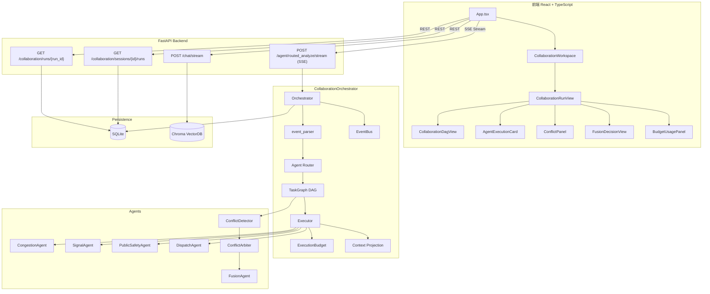

# Phase 9 — 多 Agent 协作通信、动态冲突仲裁与多轮会话恢复

> **状态**: 已完成
> **测试**: 283 passed / TypeScript 0 errors
> **日期**: 2026-07-24
> **分支**: `feature/stage-9-multi-agent-collaboration`
> **分支**: `feature/stage-9-multi-agent-collaboration`

---

## 1. 背景与目标

### 问题陈述

前序阶段已实现多 Agent 独立分析，但存在以下结构性缺陷：

| 缺陷 | 影响 |
|------|------|
| 无标准通信协议 | Agent 间消息格式不一致，无法审计追踪 |
| 无显式 DAG 编排 | 执行顺序隐式耦合，扩展困难 |
| 冲突检测后无仲裁层 | 检测到的冲突无法系统化解决 |
| 无持久化审计 | 运行历史无法恢复、无法追溯 |
| 无上下文裁剪 | Agent 可能访问不应访问的数据 |
| 前端无多 Run 隔离 | 多轮协同分析状态互相覆盖 |
| currentEvent 被上一轮污染 | 动态字段静默继承，数据交叉污染 |
| session_created 无 runId 被截断 | Sidebar 不显示新会话 |

### Phase 9 目标

从"能跑"升级到"可生产可审计"的多 Agent 协同系统：标准协议、显式编排、完整审计、严格隔离。

---

## 2. 模块目录结构

```
backend/agent/collaboration/
├── __init__.py             # 模块入口
├── protocol.py             # Pydantic 标准消息协议（AgentMessage/AgentResult/ConflictRecord/ArbitrationResult）
├── roles.py                # Agent 角色能力注册表（REGISTERED_AGENTS）
├── state.py                # 共享运行状态（CollaborationRunState / 11 状态机）
├── task_graph.py           # DAG 任务图（CollaborationTaskGraph / AgentTaskNode）
├── orchestrator.py         # 协作编排器（CollaborationOrchestrator / 冲突检测 / 融合 / 仲裁）
├── executor.py             # Agent 执行适配器（execute_single_agent / 上下文裁剪 / 重试）
├── budget.py               # 执行预算控制（ExecutionBudget）
├── context_projection.py   # 上下文裁剪与字段校验（project_context_for_agent）
├── event_bus.py            # 内存事件总线（InMemoryEventBus / 幂等去重）
├── event_parser.py         # 自然语言事件解析器 + currentEvent 构建器
├── agents.py               # 系统 Agent 实现（dispatch/conflict_detector/conflict_arbiter/fusion）
├── db_repository.py        # SQLite 持久化（5 张表 + previous_run_context 加载）
└── repository.py           # 内存存储（InMemoryCollaborationRepository，测试用）

frontend/src/
├── types/collaboration.ts              # TypeScript 类型定义（RunStatus/TaskStatus/CollaborationRun...）
├── api/collaborationApi.ts             # 协作 API 封装
├── api/streamApi.ts                    # SSE 流式 API
├── utils/collaborationEventReducer.ts  # SSE 事件归约器
├── components/collaboration/
│   ├── CollaborationRunView.tsx        # Run 详情主视图（含 DAG/Session/Run 导航）
│   ├── CollaborationDagView.tsx        # DAG 可视化（5 层拓扑展示）
│   ├── AgentExecutionCard.tsx          # Agent 执行卡片（findings/confidence/suggestion）
│   ├── ConflictPanel.tsx               # 冲突面板（type/severity/participants/resolution）
│   ├── FusionDecisionView.tsx          # 融合决策视图（summary/actionPlan/arbitration）
│   ├── BudgetUsagePanel.tsx            # 预算消耗面板
│   └── ErrorBoundary.tsx               # 渲染异常降级 UI
```

---

## 3. Agent 注册机制

### 注册表结构

每个 Agent 在 `REGISTERED_AGENTS` dict 中注册：

```python
REGISTERED_AGENTS = {
    "CongestionAgent": {
        "name": "CongestionAgent",
        "role": "拥堵分析",
        "responsibilities": ["分析平均速度、排队长度、拥堵等级、拥堵扩散和通行能力"],
        "forbidden_responsibilities": ["不得给出信号配时具体秒数", "不得声称已通知交警"],
        "accepted_message_types": ["task.assign", "task.started"],
        "produced_message_types": ["task.result", "task.failed"],
        "allowed_tools": [],
        "allowed_input_fields": ["eventType", "roadName", "direction", "avgSpeed",
                                  "queueLength", "duration", "timePeriod", "weather", "isMainRoad"],
        "required_input_fields": ["roadName", "avgSpeed", "queueLength"],
        "max_calls": 2,
        "max_retries": 1,
        "timeout_seconds": 30,
        "dependencies": [],
    },
    # ... 其他 6 个 Agent
}
```

### 注册 Agent 总览

| Agent | 类型 | max_calls | max_retries | timeout_seconds | dependencies |
|-------|------|-----------|-------------|-----------------|-------------|
| CongestionAgent | 领域 | 2 | 1 | 30 | [] |
| SignalAgent | 领域 | 2 | 1 | 30 | [] |
| PublicSafetyAgent | 领域 | 2 | 1 | 30 | [] |
| DispatchAgent | 领域 | 2 | 1 | 30 | [CongestionAgent, SignalAgent] |
| ConflictDetector | 系统 | 1 | 0 | 10 | [] |
| ConflictArbiter | 系统 | 5 | 1 | 30 | [] |
| FusionAgent | 系统 | 2 | 1 | 30 | [CongestionAgent, SignalAgent, DispatchAgent, ConflictArbiter] |

### 注册校验

`AgentMessage.sender` 和 `AgentMessage.receiver` 通过 `is_registered_agent()` Pydantic validator 校验，未注册 Agent 拒绝通信。

---

## 4. AgentMessage 协议

### 消息结构

```python
class AgentMessage(BaseModel):
    protocol_version: str = "1.0"
    message_id: str                  # 全局唯一 ID
    run_id: str                      # 运行实例 ID
    session_id: str                  # 会话 ID
    trace_id: str = ""               # 追踪 ID
    task_id: str = ""                # 任务 ID
    parent_message_id: Optional[str] # 父消息 ID
    sender: str                      # 发送方（必须已注册）
    receiver: str                    # 接收方（必须已注册）
    message_type: str                # 14 种标准类型之一
    phase: str = "routing"           # 执行阶段
    priority: int = 5                # 优先级 1-10
    attempt: int = 1                 # 尝试次数
    deadline: Optional[str]          # 截止时间 ISO
    payload: Dict[str, Any]          # 消息负载
    context_refs: List[str]          # 引用的上下文 ID
    evidence_refs: List[str]         # 引用的证据 ID
    created_at: str                  # 创建时间
```

### 14 种消息类型

| 类型 | 用途 | 发送方 | 接收方 |
|------|------|--------|--------|
| `task.assign` | 分配任务 | Orchestrator | Agent |
| `task.started` | 任务开始 | Orchestrator | Agent |
| `task.result` | 任务结果 | Agent | Orchestrator |
| `task.failed` | 任务失败 | Agent/Orchestrator | Orchestrator |
| `tool.request` | 工具调用请求 | Agent | Orchestrator |
| `tool.result` | 工具调用结果 | Orchestrator | Agent |
| `conflict.detected` | 冲突检测 | ConflictDetector | Orchestrator |
| `arbitration.request` | 仲裁请求 | Orchestrator | ConflictArbiter |
| `arbitration.result` | 仲裁结果 | ConflictArbiter | Orchestrator |
| `fusion.request` | 融合请求 | Orchestrator | FusionAgent |
| `run.completed` | 运行完成 | FusionAgent | Orchestrator |
| `run.failed` | 运行失败 | Orchestrator | All |
| `heartbeat` | 心跳 | Any | Any |

### 相关 Pydantic 模型

```python
class AgentResult(BaseModel):       # Agent 结构化结果
class AgentTask(BaseModel):         # 分配给 Agent 的任务
class ToolRequest(BaseModel):       # 工具调用请求
class ToolResult(BaseModel):        # 工具调用结果
class ConflictRecord(BaseModel):    # 冲突记录
class ArbitrationResult(BaseModel): # 仲裁结果
```

---

## 5. Shared Run State

### 11 状态状态机

```
created → routing → running → arbitrating → fusing → completed
                              ↓            ↓       ↓
                      requires_human_review  partial_success
                                                   ↓
                                                failed

interrupted (可在 routing/running/arbitrating/fusing 任意点中断)
```

### 合法转换表

```python
VALID_TRANSITIONS = {
    "created": {"routing"},
    "routing": {"running", "failed", "interrupted"},
    "running": {"arbitrating", "fusing", "partial_success", "failed", "interrupted", "completed"},
    "arbitrating": {"fusing", "requires_human_review", "failed", "interrupted"},
    "fusing": {"completed", "partial_success", "failed", "interrupted"},
}
```

### 关键字段

| 字段 | 类型 | 说明 |
|------|------|------|
| `run_id` / `session_id` / `trace_id` | str | 三重标识 |
| `status` | str | 当前状态（含合法转换校验） |
| `normalized_event` | Dict | = currentEvent（严格仅当前消息解析） |
| `previous_run_context` | Optional[Dict] | 独立的上一次运行上下文（不合并到 normalized_event） |
| `original_input` | Dict | 原始输入 |
| `selected_agents` / `skipped_agents` | List[str] | 路由结果 |
| `task_graph` | Dict | DAG 序列化 |
| `task_results` | Dict[str, Any] | 各 Agent 分析结果 |
| `conflicts` | List[Dict] | 冲突列表 |
| `arbitration_results` | List[Dict] | 仲裁结果列表 |
| `final_decision` | Dict | 融合最终决策 |
| `evidence_pool` | List[Dict] | 证据池 |
| `failed_agents` / `retry_counts` | List[str] / Dict | 失败追踪 |
| `execution_budget` / `budget_usage` | Dict | 预算配置和消耗 |

---

## 6. TaskGraph DAG

### AgentTaskNode

```python
class AgentTaskNode:
    task_id: str          # 唯一标识
    run_id: str           # 所属运行
    agent_name: str       # Agent 名称（必须已注册）
    task_type: str        # analyze / dispatch / conflict_detect / arbitrate / fusion
    depends_on: List[str] # 依赖的 task_id 列表
    status: str           # pending / ready / running / succeeded / retrying / skipped / failed / timed_out / blocked
    priority: int         # 优先级
    attempt: int          # 尝试次数
    max_retries: int      # 最大重试
    timeout_seconds: int  # 超时
    input_snapshot: Dict  # 输入快照
    output_snapshot: Dict # 输出快照
```

### CollaborationTaskGraph

```python
class CollaborationTaskGraph:
    def add_task(task)           # 添加节点（检查重复 task_id + Agent 注册）
    def validate_dependencies()  # 检查依赖存在性 + DFS 循环检测
    def get_ready_tasks()        # 返回依赖全部满足的 pending 任务
    def mark_running(task_id)    # pending/retrying → running
    def mark_succeeded(task_id)  # → succeeded
    def mark_failed(task_id)     # → retrying（未耗尽重试）/ failed（耗尽）+ 级联 block
    def mark_skipped(task_id)    # → skipped + 级联 block
    def is_completed()           # 所有任务 succeeded/skipped?
    def has_failed_tasks()       # 有 failed 任务?
    def topological_order()      # DFS 拓扑排序
```

### 5 层 DAG 构建

**无冲突场景**（4 层）:
```
第1层: CongestionAgent / SignalAgent / PublicSafetyAgent（领域分析，并行）
第2层: DispatchAgent（依赖所有领域 Agent）
第3层: ConflictDetector（依赖 DispatchAgent）
第4层: FusionAgent（依赖 ConflictDetector）
```

**有冲突场景**（5 层）:
```
第1层: CongestionAgent / SignalAgent / PublicSafetyAgent
第2层: DispatchAgent
第3层: ConflictDetector
第4层: ConflictArbiter    ← 动态插入（仅当 high/critical 冲突）
第5层: FusionAgent        ← 依赖从 ConflictDetector 重布线到 ConflictArbiter
```

### 动态插入机制

```python
has_high = conflicts and any(c.get("severity") in ("high", "critical") for c in conflicts)
if has_high:
    arbiter_task = AgentTaskNode("task_arbiter", run_id, "ConflictArbiter",
                                  "arbitrate", depends_on=["task_conflict_detect"])
    graph.add_task(arbiter_task)
    graph.tasks["task_fusion"].depends_on = ["task_arbiter"]  # 重布线
    graph.validate_dependencies()  # 校验通过则生效，失败则回滚
```

### 失败传播

当任务标记 `failed` 后，所有依赖它的 `pending` 任务自动变为 `blocked`：
```python
def _block_dependents(self, failed_id: str):
    for task in self.tasks.values():
        if failed_id in task.depends_on and task.status == "pending":
            task.status = "blocked"
```

---

## 7. Orchestrator 执行流程

### 完整流程

```python
class CollaborationOrchestrator:
    async def execute(run_id, session_id, event_info, selected_agents, ...):
        # 1. 创建 CollaborationRunState
        #    - normalized_event = event_info  # = currentEvent only
        #    - previous_run_context = previous_run_context  # separate!
        # 2. 持久化初始 state
        # 3. 发送 run_created SSE
        # 4. transition → "routing"
        # 5. 发送 agent_route_done SSE
        # 6. 构建初始 DAG
        #    - domain agents → DispatchAgent → ConflictDetector → FusionAgent
        # 7. validate_dependencies()
        # 8. 发送 task_graph_created SSE
        # 9. transition → "running"
        # 10. 循环:
        #     - get_ready_tasks()
        #     - for each ready task:
        #       - mark_running
        #       - 发送 task_started SSE
        #       - 系统 Agent (ConflictDetector/ConflictArbiter/FusionAgent) → 内联执行
        #       - 领域 Agent → execute_single_agent()
        #       - ConflictDetector 后条件插入 ConflictArbiter（动态）
        #       - 发送 task_succeeded/task_failed SSE
        # 11. 所有层完成
        # 12. 更新 state（status/budget_usage/failed_agents）
        # 13. 持久化所有 task + run state
        # 14. 发送 run_completed SSE
```

### Completion 判定

```python
if has_agent_results and fusion_ok and all_done:
    state.transition("completed")
elif has_agent_results and not fusion_ok:
    state.final_decision = _build_fusion(state)  # 模板降级
    state.transition("completed")
elif has_agent_results:
    state.transition("partial_success")
else:
    state.transition("failed")
```

---

## 8. Executor：超时、重试和预算

### execute_single_agent

```python
async def execute_single_agent(task, state, budget, retry_delay=0.01) -> AgentExecutionResult:
    for attempt in range(1, task.max_retries + 2):
        # 1. Budget check: budget.can_call_agent(agent_name)
        # 2. Record: budget.record_agent_call(agent_name)
        # 3. Context projection: project_context_for_agent(state, agent_name)
        # 4. Validate: validate_required_fields(state, agent_name)
        # 5. Execute: await _call_agent_function(agent_name, ctx)
        # 6. Wrap: AgentResult(...)
        # 7. Publish: bus.publish(task.result message)
        # 8. Return: AgentExecutionResult(success=True, ...)
```

### 错误分类

| 错误类型 | 可重试 | 处理 |
|----------|--------|------|
| `asyncio.TimeoutError` | 是 | 等待 retry_delay × attempt 后重试 |
| 临时异常（网络、超时等） | 是 | 同上 |
| `ValidationError` | 否 | 直接返回失败 |
| `"缺少必要"` | 否 | 直接返回失败 |
| `"未注册"` | 否 | 直接返回失败 |
| `"非法"` | 否 | 直接返回失败 |

### 超时保护

领域 Agent 通过 `asyncio.wait_for(execute_single_agent(...), timeout=task.timeout_seconds)` 保护，超时后 task 标记 `timed_out`。

---

## 9. ExecutionBudget

```python
class ExecutionBudget:
    max_agents: int = 6          # 最大领域 Agent 数量
    max_total_tasks: int = 12    # 最大任务总数
    max_agent_calls: int = 2     # 每个 Agent 调用上限
    max_tool_calls: int = 0      # 工具调用上限（当前未用）
    max_retries: int = 2         # 最大重试数
    max_total_seconds: int = 120 # 总超时
    max_llm_calls: int = 5       # LLM 调用上限
```

实际协同分析传入值：
```python
budget = ExecutionBudget(max_agents=4, max_agent_calls=2, max_retries=1, max_total_seconds=90)
```

---

## 10. EventBus

### InMemoryEventBus

```python
class InMemoryEventBus:
    def publish(message: Dict)     # 发布消息（message_id 幂等去重，重复消息跳过）
    def subscribe(message_type: str, handler: Callable)  # 按类型订阅
    def get_history(run_id: str)   # 按 run_id 过滤历史
    def clear()                    # 清空（测试用）
```

### 设计意图

当前为内存实现，接口设计预留 Redis Streams 替换空间。`_idempotency_keys` set 保证相同 `message_id` 不会被重复处理。

---

## 11. Context Projection

### project_context_for_agent

```python
def project_context_for_agent(state: Dict, agent_name: str) -> Dict:
    cap = get_agent_capability(agent_name)
    allowed = set(cap["allowed_input_fields"])
    # 仅从 normalized_event 中提取 allowed 字段
    projected = {field: state["normalized_event"].get(field) for field in allowed}

    # 特殊处理：
    if agent_name == "DispatchAgent":
        projected["domain_results"] = _extract_domain_results(state)  # 领域结果
    if agent_name == "ConflictArbiter":
        projected["conflict_data"] = state["conflicts"]               # 冲突数据
    if agent_name == "FusionAgent":
        projected["completed_results"] = state["task_results"]        # 全部结果
        projected["arbitration_results"] = state["arbitration_results"]
    return projected
```

### validate_required_fields

检查 Agent 的 `required_input_fields` 是否都在 state 中，返回缺失字段列表。

---

## 12. ConflictDetector

### 检测算法

`_detect_simple_conflicts(state)` 基于关键词匹配检测 4 类冲突：

```python
def _detect_simple_conflicts(state) -> List[Dict]:
    conflicts = []
    signal = state.task_results.get("SignalAgent", {})
    safety = state.task_results.get("PublicSafetyAgent", {})
    congestion = state.task_results.get("CongestionAgent", {})

    # 1. Signal findings 含 "信号/配时/绿/周期" AND Safety findings 含 "学校/医院/行人/过街/安全"
    #    → strategy_conflict (high)
    #    → priority_conflict (high)
    #    → resource_conflict (high)

    # 2. Congestion findings 含 "分流/放行/通行" AND Safety findings 含 "学校/行人/过街/安全"
    #    → safety_conflict (medium)

    return conflicts
```

### 局限性

- 仅关键词匹配，未使用语义相似度或 LLM
- 可能漏检（同义词不匹配）或误检（关键词出现在否定上下文中）

---

## 13. ConflictArbiter

### 仲裁规则

```python
def conflict_arbiter(conflict: Dict) -> Dict:
    if conflict["type"] == "strategy_conflict" and severity in ("low", "medium"):
        return {
            "resolved": True,
            "resolution": "安全优先：在保障行人/急救通行的前提下实施信号优化",
            "reasoning": "安全优先级高于通行效率",
            "requires_human_review": False,
        }
    if severity == "high":
        return {
            "resolved": False,
            "resolution": "高风险冲突需要人工研判",
            "reasoning": "证据不足以自动裁决",
            "requires_human_review": True,
        }
    # 默认：低风险自动解决
    return {"resolved": True, "resolution": "已按默认规则融合", ...}
```

### 安全优先原则

```python
safety_first = (
    "在学生过街安全与机动车通行效率冲突时，学生生命安全绝对优先。"
    "行人相位保障是第一原则；"
    "机动车绿灯延长必须在确保行人安全过街时间充足后方可实施。"
)
```

### 限制声明

```python
limitations = [
    "信号配时精确值需现场勘查确认",
    "学生过街流量需学校提供统计数据",
]
```

---

## 14. FusionAgent

### LLM 流式融合

```python
# 构建 prompt（Agent 结果 + 仲裁结果）
agent_text = "\n".join(
    f"[{a}] findings: {r.get('findings')} suggestion: {r.get('suggestion')}"
    for a, r in state.task_results.items()
)
if state.arbitration_results:
    agent_text += f"\n\n仲裁结果: {arb_text}"

prompt = f"基于以下多Agent协同分析结果，生成一段自然语言融合决策总结（200字以内）：\n\n{agent_text}\n\n融合决策："

# DeepSeek stream=true
stream = client.chat.completions.create(
    model=DEEPSEEK_MODEL, messages=[{"role": "user", "content": prompt}],
    temperature=0.3, max_tokens=500, stream=True, timeout=20
)
for chunk in stream:
    delta = chunk.choices[0].delta.content
    if delta:
        yield sse_event("fusion_delta", {"text": delta, "executionMode": "llm"})
```

### 模板降级

```python
def _build_fusion(state) -> str:
    agents = [name for name, r in state.task_results.items() if r.get("findings")]
    parts = [f"综合 {len(agents)} 个 Agent 的分析结果"]
    if state.conflicts:
        parts.append(f"，检测到 {len(state.conflicts)} 个建议冲突")
        # ... 仲裁消费
    for name, r in state.task_results.items():
        if r.get("suggestion"):
            parts.append(f"[{name}] {r['suggestion']}。")
    return "".join(parts)
```

---

## 15. SSE 事件定义

### 完整事件链

```
session_created → run_created → agent_route_done → task_graph_created
→ task_ready × N → task_started × N
→ budget_updated + agent_result + task_succeeded × N（每个领域 Agent）
→ conflict_check_done
→ [task_ready ConflictArbiter]（动态，仅 high/critical 冲突时）
→ task_started ConflictArbiter → arbitration_result × N → task_succeeded ConflictArbiter
→ fusion_start → fusion_delta × N → fusion_done → run_completed
→ done
```

### 事件格式示例

**session_created**（无 runId）:
```json
{"eventType": "session_created", "sessionId": "sess_20260724..."}
```

**run_created**:
```json
{
  "runId": "run_1710000000", "sessionId": "sess_...",
  "userQuery": "人民路小学门口...", "contextPolicy": "fresh_event",
  "fieldSources": {"avgSpeed": "current_message", "nearbySchool": "current_message", ...},
  "previousRunContext": null
}
```

**arbitration_result**:
```json
{
  "runId": "run_1710000000", "conflictId": "arb_0",
  "requiresHumanReview": true,
  "safetyFirstRule": "在学生过街安全与机动车通行效率冲突时...",
  "resolution": "高风险冲突需要人工研判",
  "limitations": ["信号配时精确值需现场勘查确认", "学生过街流量需学校提供统计数据"]
}
```

**agent_result**:
```json
{
  "agentName": "CongestionAgent", "taskId": "task_0_CongestionAgent",
  "status": "completed", "attempt": 1, "executionMode": "rule",
  "result": {
    "urgency": "high", "findings": ["平均车速仅 8.0 km/h..."],
    "recommendation": "通知交警+信号中心，上游分流", "confidence": 0.7,
    "evidenceRefs": [], "limitations": []
  }
}
```

---

## 16. SQLite 审计表设计

### 5 张表完整 DDL

```sql
CREATE TABLE collaboration_runs (
    run_id TEXT PRIMARY KEY, session_id TEXT, trace_id TEXT,
    status TEXT, protocol_version TEXT DEFAULT '1.0',
    normalized_event TEXT DEFAULT '{}',
    selected_agents TEXT DEFAULT '[]', skipped_agents TEXT DEFAULT '[]',
    failed_agents TEXT DEFAULT '[]', budget_usage TEXT DEFAULT '{}',
    final_decision TEXT DEFAULT '',
    previous_run_context TEXT DEFAULT '{}',  -- ALTER TABLE 兼容迁移
    started_at TEXT, updated_at TEXT, completed_at TEXT
);

CREATE TABLE collaboration_tasks (
    task_id TEXT NOT NULL, run_id TEXT NOT NULL,
    agent_name TEXT, task_type TEXT, status TEXT DEFAULT 'pending',
    depends_on TEXT DEFAULT '[]', priority INTEGER DEFAULT 5,
    attempt INTEGER DEFAULT 0, max_retries INTEGER DEFAULT 1,
    timeout_seconds INTEGER DEFAULT 30,
    input_snapshot TEXT DEFAULT '{}', output_snapshot TEXT DEFAULT '{}',
    error_code TEXT DEFAULT '', error_message TEXT DEFAULT '',
    started_at TEXT, completed_at TEXT,
    PRIMARY KEY (run_id, task_id)
);

CREATE TABLE collaboration_messages (
    message_id TEXT PRIMARY KEY, run_id TEXT, trace_id TEXT, task_id TEXT,
    sender TEXT, receiver TEXT, message_type TEXT, phase TEXT DEFAULT '',
    attempt INTEGER DEFAULT 1, payload TEXT DEFAULT '{}',
    evidence_refs TEXT DEFAULT '[]', created_at TEXT
);

CREATE TABLE collaboration_conflicts (
    conflict_id TEXT NOT NULL, run_id TEXT NOT NULL,
    conflict_type TEXT DEFAULT '', field TEXT DEFAULT '',
    participants TEXT DEFAULT '[]', proposals TEXT DEFAULT '[]',
    severity TEXT DEFAULT 'low', status TEXT DEFAULT 'open',
    resolution TEXT DEFAULT '', resolved_by TEXT DEFAULT '',
    requires_human_review INTEGER DEFAULT 0,
    created_at TEXT, resolved_at TEXT,
    PRIMARY KEY (run_id, conflict_id)
);

CREATE TABLE collaboration_events (
    event_id TEXT NOT NULL, run_id TEXT NOT NULL,
    event_type TEXT, payload TEXT DEFAULT '{}',
    sequence_number INTEGER DEFAULT 0, created_at TEXT,
    PRIMARY KEY (run_id, event_id)
);
```

### 索引

```sql
CREATE INDEX idx_collab_msgs_run ON collaboration_messages(run_id);
CREATE INDEX idx_collab_tasks_run ON collaboration_tasks(run_id);
CREATE INDEX idx_collab_events_run ON collaboration_events(run_id);
```

### ER 关系

```
collaboration_runs (1) ──┬─ (N) collaboration_tasks
                          ├─ (N) collaboration_messages
                          ├─ (N) collaboration_conflicts
                          └─ (N) collaboration_events
```

---

## 17. Session 与 Run 关系

### 数据流

```
POST /agent/routed_analyze/stream (sessionId=null, contextPolicy=fresh_event)
  → 创建 chat_session sess_A（mode="collaboration"）
  → 创建 collaboration_run run_1
  → SSE: session_created(sess_A)  # 无 runId

POST /agent/routed_analyze/stream (sessionId=sess_A, contextPolicy=continue_event)
  → 复用 sess_A
  → 创建 collaboration_run run_2
  → SSE: run_created（含 previousRunContext）
  → 无 session_created

POST /agent/routed_analyze/stream (sessionId=sess_A, contextPolicy=fresh_event)
  → 复用 sess_A
  → 创建 collaboration_run run_3
```

### currentEvent / previousRunContext 隔离

```python
# Step 1: 仅从当前消息解析
nl_parsed = parse_content_to_event(content_text)

# Step 2: 严格构建 currentEvent — 永不合并上一轮数据
current_event = build_current_event(nl_parsed, explicit, context_policy)
# currentEvent.avgSpeed = 8.0 (来自当前消息 "车速8")
# currentEvent.queueLength = None (当前消息未提供)
# currentEvent.fieldSources.avgSpeed = "current_message"
# currentEvent.fieldSources.queueLength = "missing"

# Step 3: 独立加载上一轮上下文 — 单独对象
previous_run_context = load_previous_run_context(session_id)
# previousRunContext.event.avgSpeed = 8.0 (上一轮的值)
# 但这不合并到 currentEvent！

# 禁止的写法（这是之前 bug 的根因）:
# currentEvent = {**previousEvent, **parsedCurrentMessage}
```

### fieldSources 追踪

```json
{
  "avgSpeed": {"source": "current_message", "value": 8.0},
  "queueLength": {"source": "missing", "value": null},
  "nearbySchool": {"source": "current_message", "value": true},
  "roadName": {"source": "current_message", "value": "人民路"},
  "weather": {"source": "current_message", "value": "clear"}
}
```

---

## 18. 历史 Run 序列化与反序列化

### 后端序列化（保存到 SQLite）

```python
# collaboration_runs 表
INSERT INTO collaboration_runs VALUES (
    run_id, session_id, trace_id, status,
    json.dumps(normalized_event),     # currentEvent
    json.dumps(selected_agents),
    json.dumps(budget_usage),
    json.dumps(final_decision),
    json.dumps(previous_run_context), # 上一轮上下文
    ...
)

# collaboration_tasks 表
# 每个 task 有 input_snapshot 和 output_snapshot (JSON)
```

### 前端反序列化

```typescript
const deserializeRunDetail = (detail: Record<string,unknown>, runId: string): CollaborationRun => {
    const run = detail.run as Record<string,unknown>;
    return {
        runId, sessionId, status, executionEngine,
        selectedAgents: parseJsonArray(run.selected_agents),
        tasks: tasks.map(deserializeTask),
        agentResults: buildAgentResultsMap(tasks),
        conflicts: (detail.conflicts as Array<any>).map(deserializeConflict),
        arbitrationResults: extractArbitrationResults(tasks),
        budgetUsage: parseBudgetUsage(run.budget_usage),
        finalDecision: parseFinalDecision(run.final_decision),
        contextPolicy, fieldSources, previousRunContext,
        isHydrated: true,
    };
};
```

### 恢复链路

```
GET /collaboration/runs/{runId}
  → { run: {...}, tasks: [...], messages: [...], conflicts: [...], events: [...] }
  → deserializeRunDetail(detail, runId)
  → setRunsById(prev => ({ ...prev, [runId]: deserialized }))
  → 渲染 CollaborationRunView
```

---

## 19. Session 删除级联逻辑

```python
def delete_session(session_id: str) -> bool:
    # 1. 初始化所有表
    init_chat_tables(); init_collaboration_tables()

    # 2. 查询关联的 collaboration_runs
    run_ids = [row[0] for row in conn.execute(
        "SELECT run_id FROM collaboration_runs WHERE session_id=?", (session_id,)
    )]

    # 3. 级联删除协作子表（按 FK 顺序）
    for run_id in run_ids:
        conn.execute("DELETE FROM collaboration_events WHERE run_id=?", (run_id,))
        conn.execute("DELETE FROM collaboration_conflicts WHERE run_id=?", (run_id,))
        conn.execute("DELETE FROM collaboration_messages WHERE run_id=?", (run_id,))
        conn.execute("DELETE FROM collaboration_tasks WHERE run_id=?", (run_id,))
    conn.execute("DELETE FROM collaboration_runs WHERE session_id=?", (session_id,))

    # 4. 级联删除 Chat 子表
    conn.execute("DELETE FROM chat_messages WHERE session_id=?", (session_id,))
    conn.execute("DELETE FROM chat_memory_summaries WHERE session_id=?", (session_id,))
    conn.execute("DELETE FROM rag_evidence_logs WHERE session_id=?", (session_id,))

    # 5. 删除 Session 本身
    conn.execute("DELETE FROM chat_sessions WHERE id=?", (session_id,))
```

---

## 20. 关键 Bug 复盘

### Bug 1: session_created 被 runId guard 截断

**现象**：新对话 Sidebar 不显示 Session 记录。

**根因**：SSE 事件处理器有 `if (!event.runId) return` 的前置 guard，但 `session_created` 事件没有 `runId` 字段（它是创建 Session 的事件，此时还没有 Run）。

**修复**（[frontend/src/App.tsx](frontend/src/App.tsx)）:
```typescript
// session_created 处理必须在 runId guard 之前
if (event.eventType === 'session_created' && event.sessionId) {
    const sid = String(event.sessionId);
    sessionIdRef.current = sid;
    onSessionCreated(sid);
    // ... 不 return，继续处理可能附带的其他数据
}

const evRunId = (event.runId as string) || '';
// runId guard 只应用于运行类事件
```

### Bug 2: activeSessionId=null 时清空 sessionIdRef

**现象**：`handleNewConversation` 后仍使用旧 sessionId。

**根因**：`sessionIdRef` 只在 `useEffect([activeSessionId])` 中同步，但 `setActiveSessionId(null)` 触发 effect 时 `activeSessionId` 已为 null，effect 不会将 null 写入 ref。

**修复**：在 `handleNewConversation` 中显式 `sessionIdRef.current = null`。

### Bug 3: JSON.stringify 遗漏 undefined sessionId

**现象**：发送请求时 `sessionId` 字段丢失。

**根因**：`JSON.stringify({ sessionId: undefined })` 会完全省略 `sessionId` 字段。

**修复**：请求前检查 sessionId 非 null，后端 `session_created` 处理中校验 `event.sessionId` 存在。

### Bug 4: 同一页面多轮创建多个 Session

**现象**：同一个协同工作区中连续提问 3 次 → Sidebar 出现 3 个 Session。

**根因**：`sessionIdRef.current` 是 stale closure，读到的是 `null`，每次请求都不传 sessionId。

**修复**：使用 `useRef` + `useEffect` 正确同步，每次 `session_created` 和 `handleAnalyze` 都通过 ref 读最新值。

### Bug 5: Run 列表 DESC → 历史轮次颠倒

**现象**：历史页面第 3 轮显示在最上面，第 1 轮在下面。

**根因**：`ORDER BY updated_at DESC` 导致最新 Run 排第一。

**修复**：改为 `ORDER BY started_at ASC, run_id ASC`。

### Bug 6: hydrateRun 依赖预存 runsById

**现象**：历史恢复时 `runsById` 为空，`hydrateRun` 读不到 `existing.contextPolicy` 等字段，渲染不完整。

**根因**：`const existing = runsById[runId]` 在空 Map 中返回 `undefined`，合并逻辑依赖 existing。

**修复**：改为 `const existing = runsById[runId] || { runId }`，从空对象也可以开始合并。

### Bug 7: currentEvent 字段污染

**现象**：第 1 轮 avgSpeed=8 → 第 2 轮 "学校拥堵" → 第 2 轮 avgSpeed=8（错误继承）。

**根因**：`build_current_event` 中动态字段（avgSpeed/queueLength/duration）在 `continue_event` 策略下可能静默继承上一轮的值。

**修复**：重构 `build_current_event`，动态字段在 `fresh_event` 和 `follow_up` 策略下强制 `None`（来源标记 `missing`），仅 `continue_event` + 显式引用时可继承。

### Bug 8: ConflictPanel agents/participants 字段不一致

**现象**：ConflictPanel 渲染黑屏（JS 错误：`c.agents is undefined`）。

**根因**：后端 `_detect_simple_conflicts` 输出 `"agents"` 字段，但前端 ConflictPanel 消费 `"participants"` 字段。保存到 DB 时从 `c.get("agents")` 读取后写入 `participants` 列。

**修复**：统一字段名，后端输出和前端消费都使用 `"agents"` 和 `"participants"` 兼容。

### Bug 9: Budget 面板 "3/0"

**现象**：Budget 面板显示 `maxAgentCalls: 0`，即 "已用 3 / 上限 0"。

**根因**：`ExecutionBudget.to_dict()` 缺少 `max_agent_calls`、`max_retries`、`max_total_seconds` 字段。

**修复**：在 `to_dict()` 中补充全部 max 字段。

### Bug 10: 会话删除后状态残留

**现象**：删除 Session 后，`activeSessionId` 仍指向已删除的 ID，导致后续请求 404。

**根因**：`handleDeleteSession` 没有清空关联状态。

**修复**：删除时同时清空 `sessionIdRef`、`activeSessionId`、`runsById`、`activeRunId`、`runList`，触发新会话流程。

---

## 21. 测试矩阵

### 后端测试（pytest）

| 测试类 | 数量 | 覆盖 |
|--------|------|------|
| TestAnalyzeEvent | 8 | 事件分析 MVP |
| TestHistory / TestEventDetail / TestStatus / TestHealth / TestStats | 12 | Phase 1 基础 |
| TestSimilarCases / TestReports / TestAlerts / TestHighRiskRoads | 15 | Phase 2 |
| TestMultiRunIsolation | 4 | 多 Run 输入隔离 |
| TestSchoolScenarioRouting | 3 | 学校触发路由 |
| TestConflictDetection | 5 | 冲突检测与仲裁 |
| TestAgentProposals | 2 | 结构化 proposal |
| TestParserFields | 4 | NL 解析字段 |
| TestRunDedup | 2 | Run 去重 |
| TestTwoRoundFinal | 2 | 双轮隔离 |
| TestDetailHydration | 3 | Run 详情水合 |
| TestFusionPersistence | 6 | 融合持久化 |
| TestSidebarLabels | 1 | 会话标签 |
| TestConflictScenarioFinal | 3 | 冲突场景回归 |
| TestConflictArbiterDagInsertion | 4 | 动态 DAG 插入 |
| TestArbitrationResultContent | 6 | 仲裁结果内容 |
| TestFinalDecisionWithArbitration | 3 | final_decision 仲裁 |
| TestSessionModeLabels | 5 | 会话标签映射 |
| TestSchoolConflictFullScenario | 6 | 冲突端到端 |
| TestHistoryRecoveryWithArbitration | 2 | 历史含仲裁 |
| TestFieldIsolation | 16 | 字段隔离 |
| TestCurrentEventSeparation | 7 | currentEvent 分离 |
| TestFieldSourcesExplicitPrevious | 3 | fieldSources 标记 |
| TestAllScenariosStillPass | 3 | 全部回归 |
| TestE2EContamination | 1 | 10 项端到端污染验证 |
| TestFrontendResilience | 14 | 前端韧性 |
| TestSessionLifecycle | 16 | 会话生命周期 |

**总计：283 passed / 0 failed**

### 前端检查

**TypeScript：0 errors**

### 手工验收

| 场景 | 输入 | 期望 |
|------|------|------|
| 普通拥堵 | "主干道平均车速8km/h，排队400米" | DAG 4 层，无仲裁 |
| 学校冲突 | "人民路小学早高峰拥堵，机动车需绿灯，学生需过街" | DAG 5 层，3 个仲裁，requiresHumanReview=true |
| 多轮隔离 | 第1轮限速8→第2轮"学校拥堵" | 第2轮 avgSpeed=None |
| 历史恢复 | 刷新→点击历史Session | 完整 DAG/冲突/仲裁/融合 |
| 会话删除 | 删除当前会话 | Sidebar 消失，状态复位 |

---

## 22. 已知限制

| 限制 | 影响 | 计划 |
|------|------|------|
| EventBus 仅内存实现 | 不能跨进程通信 | Phase 10 Redis Streams |
| 领域 Agent 同层串行 | 3 个领域 Agent 依次执行，非并行 | Phase 10 asyncio.gather |
| ConflictDetector 仅关键词匹配 | 可能漏检/误检 | Phase 10 LLM 辅助 |
| ConflictArbiter 仅规则引擎 | 复杂冲突缺深度分析 | Phase 10 LLM 辅助仲裁 |
| SQLite 单机存储 | 不支持分布式 | Phase 10 PostgreSQL |
| 无鉴权/RBAC | 单用户，无权限隔离 | Phase 10 JWT/OAuth2 |
| Memory 仅 Session 内上下文 | 跨 Session 无知识积累 | Memory V2 |
| 无 Evaluation 体系 | 无法量化路由/冲突/RAG 质量 | 评测集建设 |
| 无 Trace/Observability | 无法监控延迟和失败率 | 分布式追踪 |

---

## 23. Phase 10 建议

1. **并行 Agent 执行**：同层领域 Agent 使用 `asyncio.gather` 并发执行，预期减少 40-60% 延迟
2. **Redis EventBus**：替换 InMemoryEventBus 为 Redis Streams/PubSub，支持多进程
3. **PostgreSQL 迁移**：SQLite → PostgreSQL，支持并发读写
4. **LLM 辅助仲裁**：关键词匹配漏检时，调用 LLM 做语义级冲突分析
5. **Memory V2**：跨 Session 结构化长期摘要，渐进式知识积累
6. **Evaluation 体系**：路由准确率、冲突召回率、RAG groundedness、端到端回归
7. **Observability**：OpenTelemetry trace、延迟分位统计、失败率监控
8. **Auth/RBAC**：JWT + 用户角色 + 数据隔离
9. **Docker Compose**：一键启动（FastAPI + React + PostgreSQL + Redis + Nginx）
10. **SUMO 仿真集成**：信号配时方案仿真验证
11. **WebSocket 大屏推送**：指挥中心实时态势更新
12. **Reliability**：取消运行、恢复运行、幂等性、并发压力测试

---

## 24. 总体架构图



---

> **文档维护说明**：修改协作核心逻辑（protocol/roles/state/task_graph/orchestrator/executor）后请同步更新此文件。
