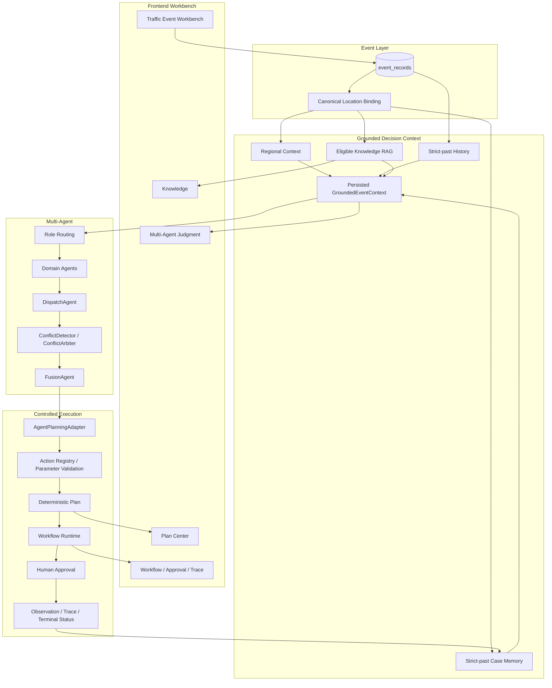
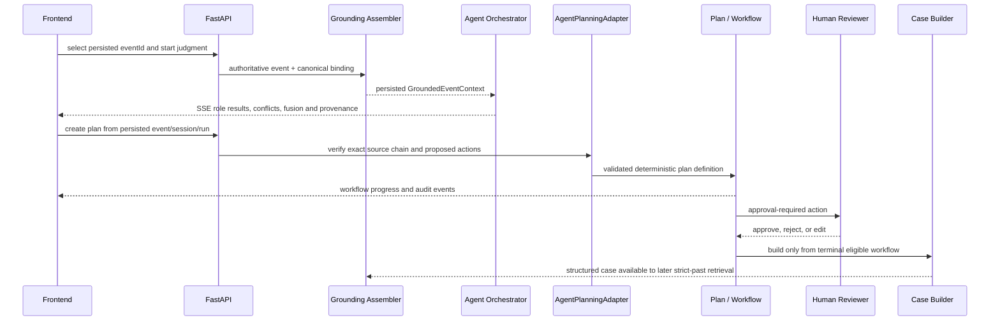

# TrafficMind 系统架构

本文描述当前已实现的产品链路和安全边界。它不是未来路线图，也不把验证 runtime 描述为生产交通系统。

## 组件视图



## Agent 角色

实际角色来自 `backend/agent/collaboration/roles.py`。

| 角色 | 类型 | 已实现职责 |
|---|---|---|
| `CongestionAgent` | 领域 | 速度、排队、拥堵扩散和通行能力分析 |
| `AccidentAgent` | 领域 | 事故严重度、交通影响与风险分析 |
| `SignalAgent` | 领域 | 信号状态、周期、绿信比和协调分析 |
| `PublicSafetyAgent` | 领域 | 学校、医院、行人和次生安全风险分析 |
| `DispatchAgent` | 处置 | 基于已完成领域结果组织分流、警力、联动和顺序 |
| `ConflictDetector` | 系统 | 比较结构化 proposals，识别策略、优先级、资源与安全冲突 |
| `ConflictArbiter` | 系统 | 按安全规则处理结构化冲突，必要时要求人工审核 |
| `FusionAgent` | 系统 | 只融合已有结果和仲裁，不引入无依据事实 |

这些角色通过受控 DAG、结构化消息和持久化 run state 协作。当前实现不等于多个自主 Agent 进行开放式协商。

## GroundedEventContext

一次事件研判先组装不可变、紧凑的 `GroundedEventContext`：

1. `currentEvent`：来自 authority event record 的事实快照。
2. `regionalContext`：active/resolved location binding 对应的区域、道路、路口和 POI。
3. `historicalContext`：同 canonical scope 且严格早于当前事件的历史记录。
4. `knowledgeContext`：满足 GLOBAL/REGIONAL scope、事件类型和 effective time 的知识证据。
5. `caseMemoryContext`：同区域、严格过去、质量状态允许的系统闭环 Case。

Wrong-region、future、current-target 和 ineligible evidence 会被排除。Snapshot 随 collaboration run 持久化，后续页面显示的是本次研判当时的依据，不使用刷新后的新数据冒充原始输入。

## 端到端执行



## Planning 与执行边界

`AgentPlanningAdapter` 读取 persisted collaboration run，校验 session 与 event identity，并将 Agent 输出分为 accepted 和 rejected recommendations。下列动作不会进入可执行 Plan：

- Action Registry 中不存在的动作。
- simulation-only 动作。
- 当前 planner 不支持的能力。
- 参数结构不符合 schema 的动作。

Plan materialization 不等于执行。Workflow Runtime 负责节点状态、审批、动作记录、重试和 terminal 状态；高风险动作必须先完成 Human Approval。模型输出不能直接调用执行工具。

## 持久化与追溯

核心追溯链：

```text
event_records.event_id
  -> collaboration_runs.normalized_event / grounding_context
  -> workflow_definition.metadata.plan
  -> workflow_runs.state.currentEvent.eventId
  -> workflow_approvals / workflow_action_records / workflow_events
  -> traffic_case_memories
```

跨页导航使用这些 persisted IDs。缺少关系时页面显示未关联；不存在的 child workflow run 显示“未找到 / 已删除”，不回退到 parent run。

## Case Memory 边界

Case Builder 只接受 terminal workflow、authority event、canonical location 和非 simulation source。Case 保存：

- compact event snapshot；
- Agent findings 与结构化 recommendations；
- Plan facts；
- human decisions；
- workflow terminal outcome 与有限 lessons；
- Event、Run、Plan、Session 和 location provenance。

Case 明确标记 `rawTranscriptStored=false`、`structuredFactsAuthoritative=true` 和 `businessOutcomeInferred=false`。完整对话、raw prompt 和完整 workflow state 不进入 Case。

## 运行时边界

- 默认开发 runtime 与钱塘 Pilot runtime 隔离。
- SQLite 和 Chroma 适用于本地验证与轻量部署，不代表高并发生产架构。
- EventBus 当前为进程内实现。
- MapLibre 只负责可视化；location identity 来自 canonical regional binding。
- 可选模型 provider 不可用时，系统按明确状态降级，不能把模板或 deterministic validation 描述为在线模型结果。
